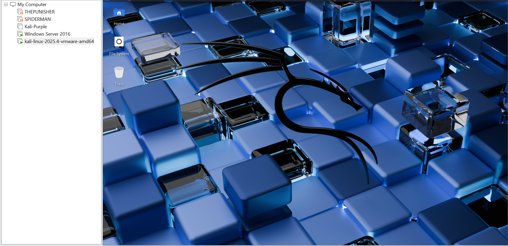

# Project 1 – Lab Setup

## Overview

This project outlines the setup of a personal Active Directory home lab used for penetration testing and detection exercises.

The environment was built using VMware Workstation and includes a Windows Server Domain Controller, multiple domain-joined workstations, and a Kali Linux attacker machine.

The objective is to create a controlled and isolated environment for practicing enumeration, exploitation, and post-exploitation techniques.

---

## Objectives

- Build a functional Active Directory domain environment  
- Configure domain users and authentication  
- Establish internal network communication between systems  
- Prepare an attacker machine for penetration testing  
- Create a stable environment for AD attack simulations  

---

## Lab Components

The lab consists of the following virtual machines:

- Kali Linux – Attacker machine  
- HYDRA-DC – Windows Server 2016 Domain Controller  
- THEPUNISHER – Windows 10 domain-joined workstation  
- SPIDERMAN – Windows 10 domain-joined workstation  

**Domain Name:** MARVEL.local  

---

## Network Configuration

The lab uses a host-only network to simulate an internal enterprise environment.

- Network Range: 192.168.208.0/24  
- Domain Controller: 192.168.208.130  
- Workstations: 192.168.208.128, 192.168.208.129  
- Kali Attacker Machine: 192.168.208.131  

The Kali machine also maintains a NAT connection for internet access (tool installation and updates), while domain systems remain isolated.

---

## User Accounts

The following domain users were created:

- tstark  
- SQLService  
- fcastle  
- pparker  

These accounts are used throughout the lab for authentication testing and credential-based attacks.

---

## Configuration Notes

- Some security controls (e.g., Windows Defender, GPO restrictions) were intentionally relaxed  
- Weak/default passwords were used to simulate real-world misconfigurations  

This allows for more realistic attack scenarios.

---

## Lab Readiness

The environment is fully operational:

- All systems communicate across the internal network  
- The attacker machine is equipped with required tools  
- The domain is configured for realistic attack simulation  

This lab serves as the foundation for all subsequent projects.
