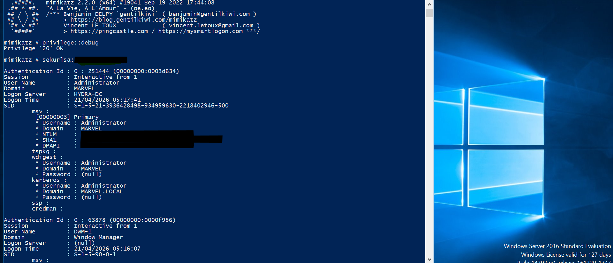
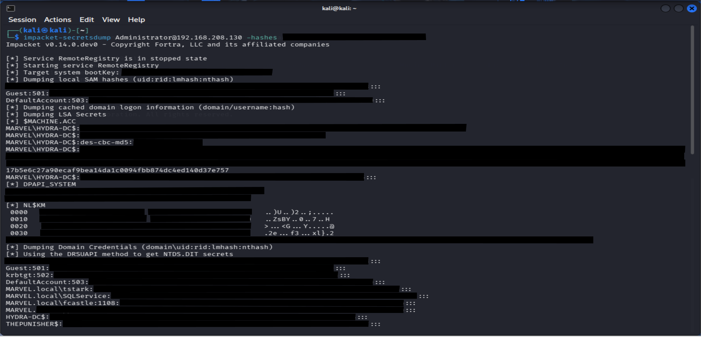
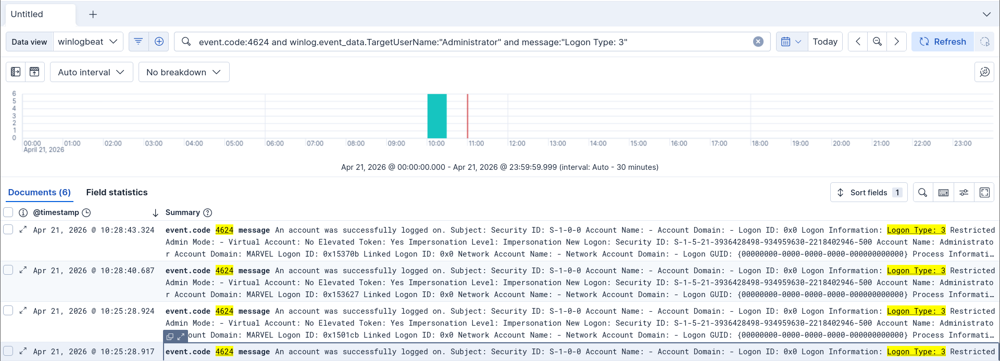

# Project 10 – Credential Access, Pass-the-Hash, and Detection Validation

---

## 10.1 Objective

The objective of this project was to simulate a post-exploitation workflow by extracting credentials from a compromised Windows host, using those credentials to perform lateral movement via Pass-the-Hash, and validating whether the activity could be identified in Elastic logs.

This project focused on:

- Credential dumping with Mimikatz  
- Pass-the-Hash authentication with Impacket  
- Remote SYSTEM-level access  
- Detection of suspicious logon activity in Elastic  

---

## 10.2 Lab Setup

The following systems were used in this project:

- **Kali Linux** – attacker machine  
- **Windows Server 2016** – target system / domain controller  
- **Elastic / Kibana** – log collection and detection validation  

### Primary Tools

- Mimikatz  
- Impacket psexec  
- Impacket secretsdump  
- Elastic Discover  

---

## 10.3 Credential Dumping with Mimikatz

After obtaining administrative access to the target host, Mimikatz was executed in order to extract credentials from memory.

### Commands Used

    privilege::debug
    sekurlsa::logonpasswords

This allowed extraction of active logon session data, including NTLM material for the **Administrator** account.

**Figure 10.1** – Mimikatz credential dump showing Administrator session details and NTLM hash extracted from memory.

---

## 10.4 Pass-the-Hash Attack

The extracted NTLM hash was then used from Kali Linux to authenticate to the Windows target without requiring the plaintext password.

### Command Used

    impacket-psexec Administrator@192.168.208.130 -hashes :<NTLM_HASH>

This successfully authenticated to the remote system and spawned a shell.

---

## 10.5 SYSTEM-Level Access

Following successful authentication, the shell was validated with:

    whoami

Output:

    nt authority\system

This demonstrated successful lateral movement and remote code execution using Pass-the-Hash.

**Figure 10.2** – Successful Pass-the-Hash execution using Impacket psexec resulting in SYSTEM-level access on the target host.

---

## 10.6 Additional Credential Extraction with secretsdump

After validating remote access, `secretsdump` was used to extract additional credential material from the target system.

### Command Used

    impacket-secretsdump Administrator@192.168.208.130 -hashes :<NTLM_HASH>

This returned local and domain credential material, including account hashes from the environment.

**Figure 10.3** – Additional credential extraction using Impacket secretsdump following successful remote authentication.

---

## 10.7 Detection Validation in Elastic

Elastic was then used to validate whether the attack could be identified through Windows event logging.

### Query Used

    event.code:4624 AND winlog.event_data.TargetUserName:"Administrator" AND message:"Logon Type: 3"

This returned successful logon events tied to the **Administrator** account using **Logon Type 3**, which indicates a network logon.

The event timestamps aligned with the timeframe of the Pass-the-Hash activity.

**Figure 10.4** – Elastic detection showing multiple Event ID 4624 network logons (Logon Type 3) for the Administrator account. The timestamps align with the Pass-the-Hash activity, indicating successful remote authentication from the attacker system.

---

## 10.8 Analysis

This project demonstrated a complete post-exploitation workflow:

- Credentials were extracted from memory using Mimikatz  
- An NTLM hash was reused to authenticate remotely  
- SYSTEM-level access was obtained on the target host  
- The activity was validated in Elastic using Windows logon events  

The key detection artifact in this project was **Event ID 4624 with Logon Type 3**, showing successful network authentication using an administrative account.

This is consistent with remote access techniques such as Pass-the-Hash.

---

## 10.9 Key Findings

This project confirmed that:

- NTLM credential material can be extracted from memory when a host is compromised  
- Plaintext passwords are not required to move laterally if usable hashes are available  
- Pass-the-Hash can result in full remote administrative access  
- Successful remote authentication can be identified through SIEM log analysis  

---

## 10.10 Mitigation Recommendations

To reduce the risk of this type of attack, organizations should:

- Restrict administrative privileges  
- Protect LSASS memory and enable credential protection features  
- Limit NTLM usage where possible  
- Monitor administrative account logons closely  
- Alert on unusual **4624 Logon Type 3** activity involving privileged accounts  
- Segment systems to reduce lateral movement opportunities  

---

## 10.11 Conclusion

Project 10 demonstrated how credential access can rapidly lead to lateral movement and high-privilege remote execution within a Windows environment.

By combining offensive actions with SIEM-based validation, this project demonstrated both attacker techniques and detection opportunities.

---
