# Project 12 – Home Network Penetration Test

A full penetration test conducted against a real home network environment using Kali Linux 2025.4 in VMware Workstation. The assessment covers network reconnaissance, port scanning, service enumeration, vulnerability identification, and remediation.

---

## 12.1 Overview

The target environment consisted of a TP-Link Archer AX10 Wi-Fi 6 router acting as the primary network gateway, connected upstream to an ISP-supplied Nokia residential gateway. The assessment identified multiple medium and low severity vulnerabilities, all of which were fully remediated during the engagement.

---

## 12.2 Objectives

- Perform host discovery and network reconnaissance across the home LAN
- Enumerate open ports and identify running services with version detection
- Identify vulnerabilities in identified service versions using CVE databases
- Test authentication controls including default credentials and account lockout
- Apply full remediation to all identified findings
- Verify remediation via follow-up scanning

---

## 12.3 Lab Environment

| Component | Details |
|---|---|
| Attacker Machine | Kali Linux 2025.4 (VMware Workstation, NAT adapter) |
| Host Machine | Windows 11 |
| Primary Target | TP-Link Archer AX10 V1.0 (Living Room) |
| Secondary Target | TP-Link Archer AX10 V3.0 (Bedroom) |
| ISP Gateway | Nokia G-440G-A Residential Gateway |
| Home Network | 192.0.0.0/24 |
| Tools Used | Nmap 7.98, Searchsploit, CherryTree |

---

## 12.4 Methodology

### 12.4.1 Host Discovery

Host discovery was performed across the full /24 subnet using Nmap with ICMP and ARP probes.

```bash
nmap -sn 192.0.0.0/24 -oA /home/kali/pentest/host_discovery
```

The scan returned 256 hosts as up. This was identified as a VMware NAT artifact — the hypervisor was intercepting ARP and ICMP probes and responding on behalf of all addresses. The only confirmed real host was the router.

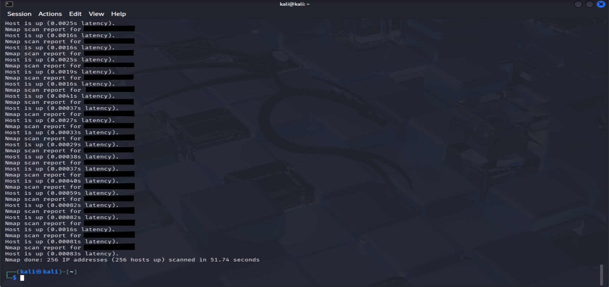

---

### 12.4.2 Port and Service Enumeration

A full TCP port scan with service version detection was performed against the confirmed target.

```bash
nmap -Pn -sV -p 53,80,443,1900,20001 [TARGET]
```

Five open TCP ports were identified. Service versions were recorded for CVE analysis.

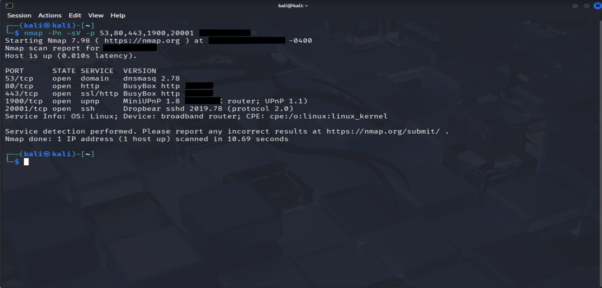

---

### 12.4.3 UPnP Enumeration

A targeted UDP scan was performed against port 1900 using the Nmap UPnP NSE script.

```bash
nmap -Pn -sU -p 1900 --script upnp-info --version-intensity 9 [TARGET]
```

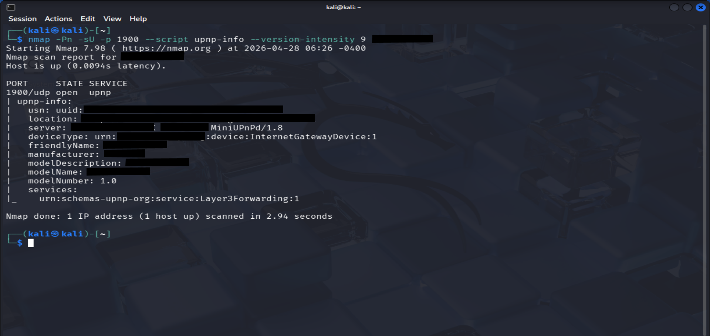

---

### 12.4.4 Vulnerability Analysis

Identified service versions were cross-referenced against Searchsploit and public CVE databases. Authentication controls were manually tested including default credentials, custom passwords, and account lockout behaviour.

### 12.4.5 Remediation

All identified findings were remediated directly via the router admin panel. A follow-up scan was performed to verify the changes.

---

## 12.5 Scan Results

| Port | State | Service | Version |
|---|---|---|---|
| 53/tcp | open | DNS | dnsmasq 2.78 |
| 80/tcp | open | HTTP | BusyBox 1.19.4 |
| 443/tcp | open | HTTPS | BusyBox 1.19.4 |
| 1900/tcp | open | UPnP | MiniUPnP 1.8 |
| 20001/tcp | open | SSH | Dropbear 2019.78 |

SSL certificate inspection confirmed a self-signed certificate issued to tplinkwifi.net with validity dates spanning 2010 to 2030 and countryName=CN — a stock TP-Link embedded certificate.

OS detection identified the target as a Linux broadband router.

---

## 12.6 Key Findings

### 12.6.1 Finding 1 — UPnP Enabled (MiniUPnP 1.8)

**Severity:** Medium

UPnP was found enabled on port 1900/tcp running MiniUPnP version 1.8. This release dates from 2014 and has multiple published CVEs including buffer overflow vulnerabilities (CVE-2013-0229, CVE-2013-0230).

UPnP allows any device on the local network to dynamically open external firewall ports without authentication. This means a compromised device or malicious application on the LAN could silently expose internal services to the internet without the user's knowledge.

**Recommendation:** Disable UPnP unless explicitly required. No legitimate home service requires UPnP to be enabled.

---

### 12.6.2 Finding 2 — Outdated SSH Service (Dropbear 2019.78)

**Severity:** Medium

SSH was found running on non-standard port 20001/tcp using Dropbear version 2019.78. This release is over six years old. The current stable release of Dropbear is 2022.83. Older versions have known CVEs and have not received security patches.

The use of a non-standard port provides minimal security benefit against targeted attacks and does not compensate for the outdated software version.

**Recommendation:** Disable SSH if not actively required. Update router firmware to replace outdated Dropbear with a current release.

---

### 12.6.3 Finding 3 — Outdated Firmware and Software Stack

**Severity:** Low

The router was running firmware version 1.3.10 Build 20240130, behind the current release of 1.3.12. The underlying software stack including BusyBox 1.19.4 and dnsmasq 2.78 were both outdated.

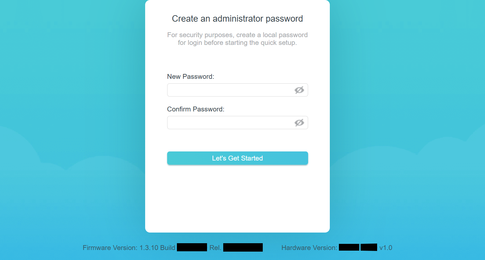

**Recommendation:** Update router firmware to the latest available release. Enable automatic firmware updates to ensure ongoing patching.

---

### 12.6.4 Finding 4 — Self-Signed SSL Certificate

**Severity:** Low

The HTTPS admin interface presented a self-signed certificate with no trusted certificate authority chain. The certificate validity dates of 2010 to 2030 and the CN=tplinkwifi.net indicate a stock factory-embedded certificate.

**Recommendation:** HTTPS enforced for all admin access to mitigate risk.

---

## 12.7 Positive Findings

| Control | Status |
|---|---|
| Non-default admin password set | Confirmed |
| Account lockout functioning | Confirmed — locked after repeated failed attempts |
| Admin panel restricted to LAN only | Confirmed — no WAN access permitted |
| SPI Firewall enabled | Confirmed |
| WAN ping response disabled | Confirmed |

---

## 12.8 Remediation Applied

| Action | Device | Status |
|---|---|---|
| Firmware updated to 1.3.12 | AX10 V1.0 (Living Room) | ✅ Complete |
| UPnP disabled | AX10 V1.0 (Living Room) | ✅ Complete |
| SSH disabled | AX10 V1.0 (Living Room) | ✅ Complete |
| HTTPS local management enabled | AX10 V1.0 (Living Room) | ✅ Complete |
| Remote management confirmed off | AX10 V1.0 (Living Room) | ✅ Complete |
| WiFi SSID changed from default | AX10 V1.0 (Living Room) | ✅ Complete |
| WiFi password changed from default | AX10 V1.0 (Living Room) | ✅ Complete |
| Auto firmware update enabled | AX10 V1.0 (Living Room) | ✅ Complete |
| Firmware confirmed current | AX10 V3.0 (Bedroom) | ✅ Complete |
| UPnP disabled | AX10 V3.0 (Bedroom) | ✅ Complete |
| HTTPS local management enabled | AX10 V3.0 (Bedroom) | ✅ Complete |
| Remote management confirmed off | AX10 V3.0 (Bedroom) | ✅ Complete |
| WiFi SSID changed from default | AX10 V3.0 (Bedroom) | ✅ Complete |
| WiFi password changed from default | AX10 V3.0 (Bedroom) | ✅ Complete |
| Auto firmware update enabled | AX10 V3.0 (Bedroom) | ✅ Complete |

---

## 12.9 Remediation Evidence

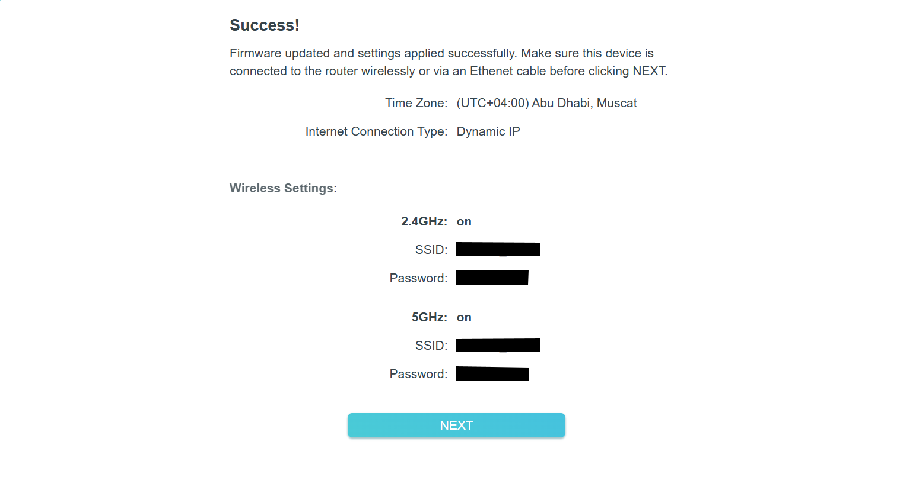

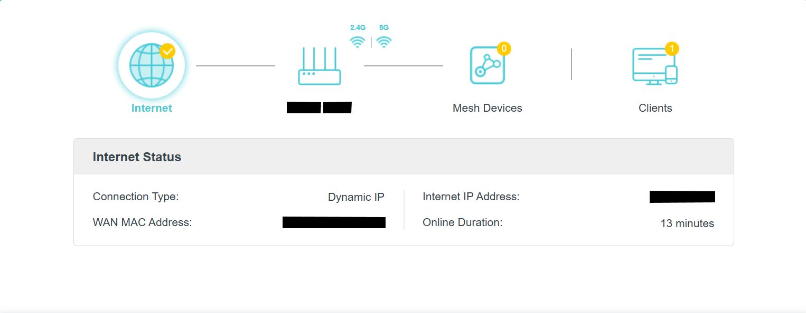

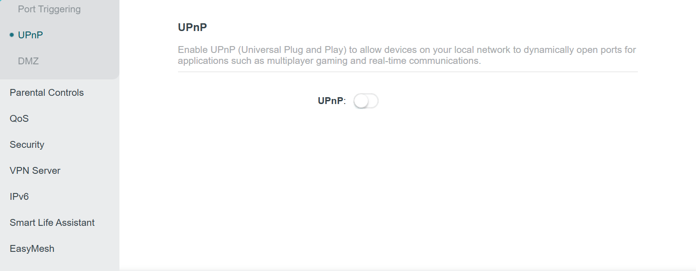

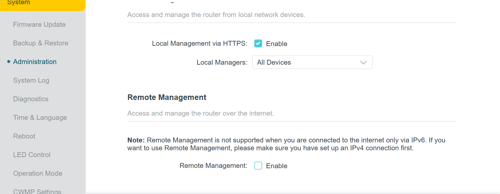

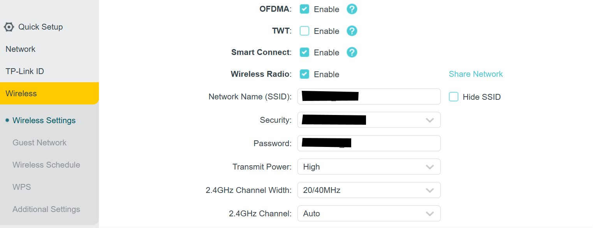

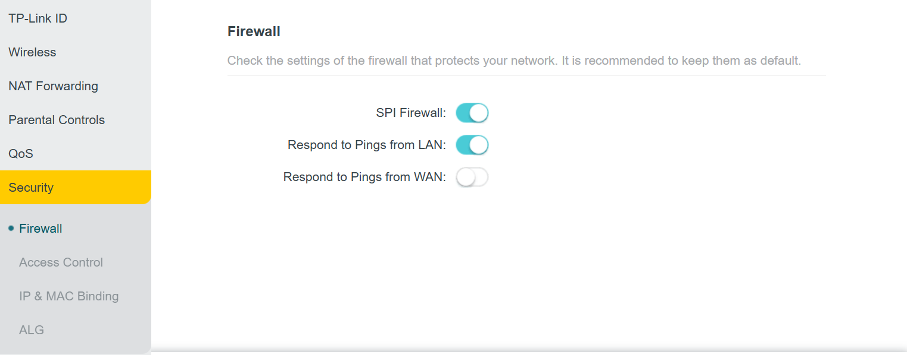

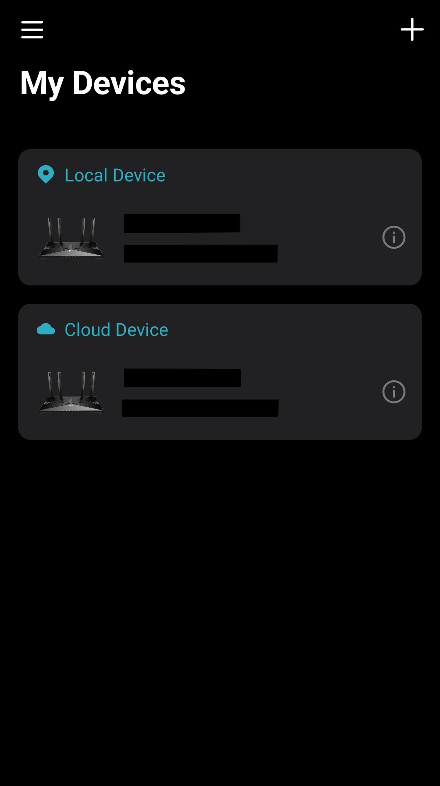

---

## 12.10 Limitations

**VMware NAT Isolation**
Kali Linux was operating on the VMware NAT subnet rather than directly on the home LAN. Raw packet routing allowed Nmap scans to reach the target but prevented TCP-based interactions. Bridged networking would have provided full access for a more complete assessment.

**Host Discovery Unreliable**
All 256 addresses in the /24 subnet responded as up during host discovery. This was identified as a VMware NAT hypervisor artifact. The only confirmed real host was the router.

**Vulnerability Scan Incomplete**
The initial vulnerability scan using `--script vuln` was run without the `-Pn` flag. The router blocked the ping probe causing Nmap to declare the host as down. The corrected command was applied in subsequent scans.

**ISP Gateway Inaccessible**
The Nokia G-440G-A residential gateway had its admin credentials locked by the ISP provider. Assessment of the upstream gateway layer was not possible without ISP involvement.

**Post-Remediation Verification Limited**
The follow-up verification scan continued to show ports 1900 and 20001 as open, believed to reflect the Nokia gateway rather than the TP-Link due to the NAT routing path. Remediation was confirmed via direct admin panel access on both routers.

---

## 12.11 Conclusion

This project demonstrated a complete penetration testing workflow against a real home network environment — from initial reconnaissance through to verified remediation.

The assessment identified four findings across two severity levels. The most significant was the UPnP service running an outdated and vulnerable version of MiniUPnP. A firmware update combined with targeted service hardening addressed all identified vulnerabilities.

The Nokia ISP gateway represents a remaining blind spot in the home network security posture. As an ISP-managed device it falls outside the scope of customer remediation and would require direct engagement with the provider to assess or harden.

---

## 12.12 Skills Demonstrated

`Network Scanning` `Host Discovery` `Service Enumeration` `OS Fingerprinting` `Version Analysis` `CVE Research` `SSL Certificate Inspection` `UPnP Enumeration` `Router Hardening` `Firmware Management` `Authentication Testing` `Remediation Verification` `Report Writing`
