# Project 13 - Segmented Network Lab

## Overview

This project documents the evolution of the existing Active Directory lab environment into a segmented enterprise-style network architecture using pfSense as a virtual firewall and the DC:1 VulnHub machine as an exposed DMZ target.

In earlier projects, the lab operated as a flat internal network where the Kali attacker machine had direct access to the Active Directory environment. While suitable for practising enumeration, credential attacks, and lateral movement, flat networks do not accurately reflect how modern enterprise environments are designed.

The architecture establishes the segmentation boundaries and firewall policy required to explore how network design controls an attacker's ability to pivot from an exposed system into internal infrastructure.

---

## Objectives

- Design and implement a segmented enterprise-style network architecture
- Deploy pfSense CE as a virtual firewall between network zones
- Separate internal infrastructure from externally reachable systems
- Configure WAN and LAN interfaces using VMware virtual networks
- Place a vulnerable host within a DMZ segment
- Validate attacker visibility and external reachability from Kali Linux
- Configure firewall rules to control traffic flow between network zones
- Create a reusable architecture for future exploitation and pivoting exercises

---

## Lab Components

The lab consists of the following virtual machines:

| Role | System | Operating System |
|---|---|---|
| Firewall / Router | pfSense | pfSense CE 2.7.2 |
| External Target | DC:1 | Debian GNU/Linux 7 |
| Attacker Machine | Kali Linux | Kali Linux 2025.4 |
| Domain Controller | HYDRA-DC | Windows Server 2016 |
| Workstation | THEPUNISHER | Windows 10 Enterprise |
| Workstation | SPIDERMAN | Windows 10 Enterprise |

Domain: MARVEL.local

---

## Network Architecture

The lab was redesigned from a flat internal network into a segmented enterprise-style architecture using pfSense as a boundary firewall.

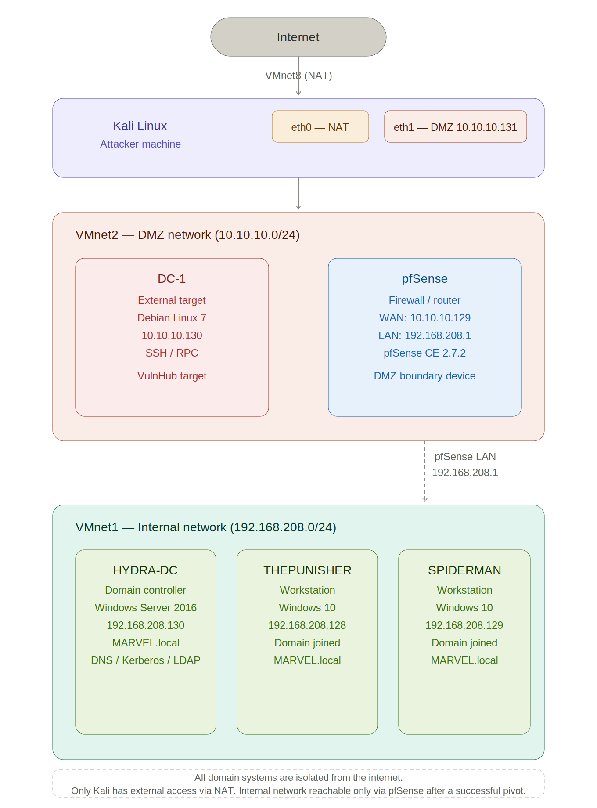

| Segment | Network | VMware Network | Key Hosts |
|---|---|---|---|
| DMZ (External) | 10.10.10.0/24 | VMnet2 | Kali eth1 (10.10.10.131), pfSense WAN (10.10.10.129), DC:1 (10.10.10.130) |
| Internal (AD) | 192.168.208.0/24 | VMnet1 | pfSense LAN (192.168.208.1), HYDRA-DC (192.168.208.130), THEPUNISHER (192.168.208.128), SPIDERMAN (192.168.208.129) |
| NAT (Internet) | 192.0.0.0/24 | VMnet8 | Kali eth0 (NAT — internet access only) |

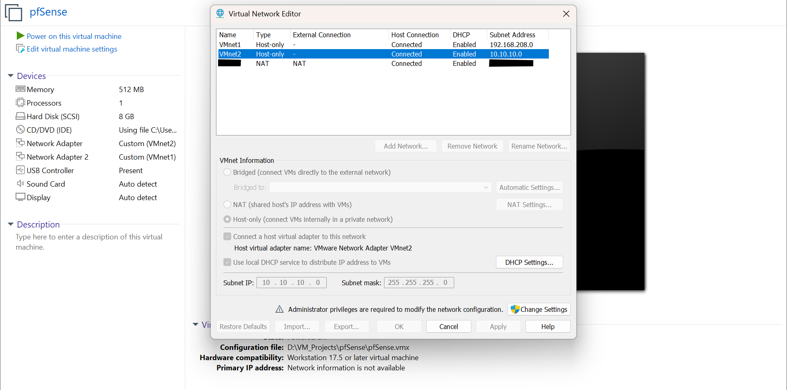

The Kali Linux attacker machine is dual-homed: internet access via NAT on eth0 and DMZ access via VMnet2 on eth1. Kali is positioned as an external attacker with access to the DMZ segment but has no direct access to the internal Active Directory network.

---

## pfSense Deployment and Interface Configuration

pfSense CE 2.7.2 was deployed as the boundary firewall with two network adapters:

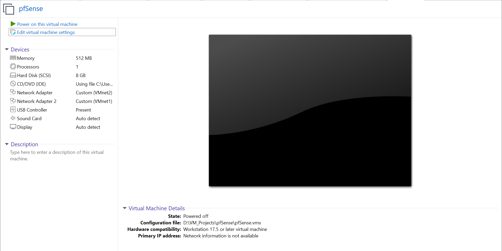

| Interface | VMware Network | IP Address | Purpose |
|---|---|---|---|
| WAN (em0) | VMnet2 | 10.10.10.129/24 | DMZ / External Segment |
| LAN (em1) | VMnet1 | 192.168.208.1/24 | Internal AD Network |

The LAN interface was configured with a static IP and DHCP range using the pfSense console:

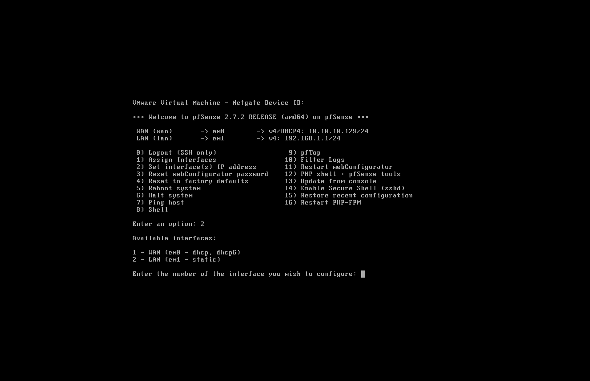

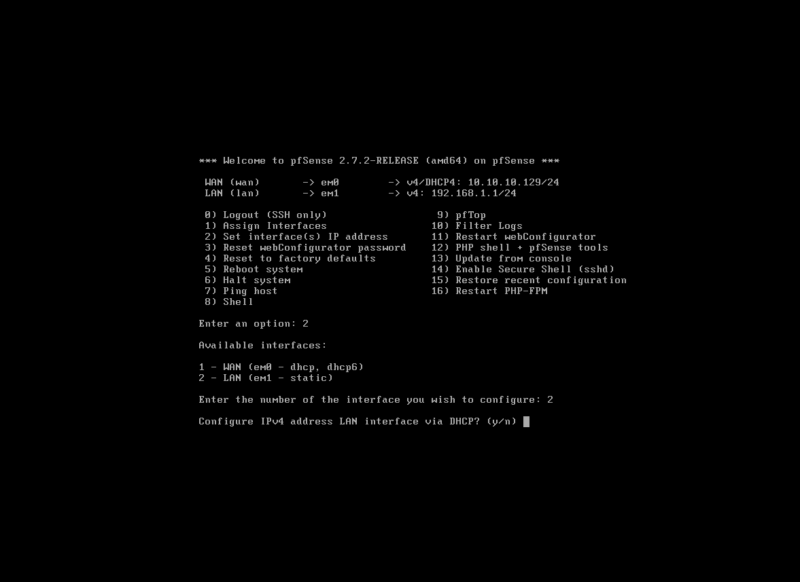

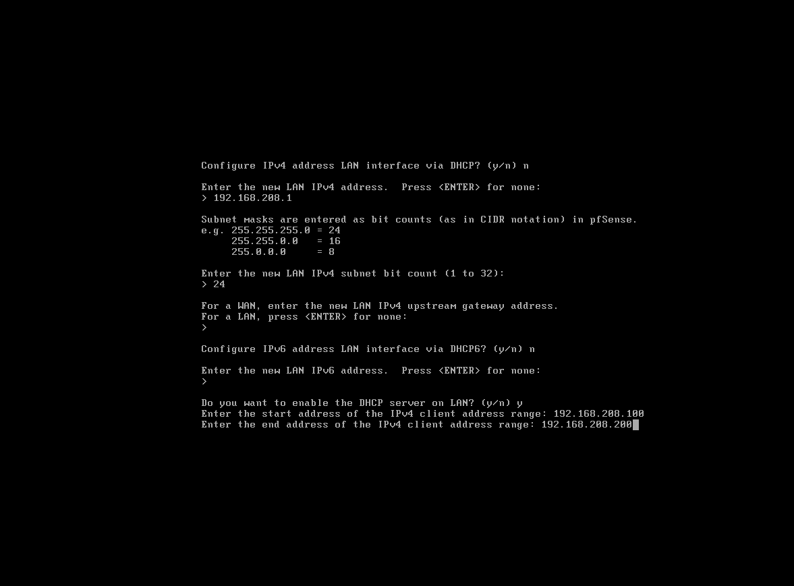

---

## DMZ Target Deployment

The DC:1 VulnHub virtual machine was imported into VMware Workstation and placed on the VMnet2 DMZ segment as an externally reachable target system.

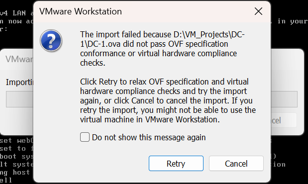

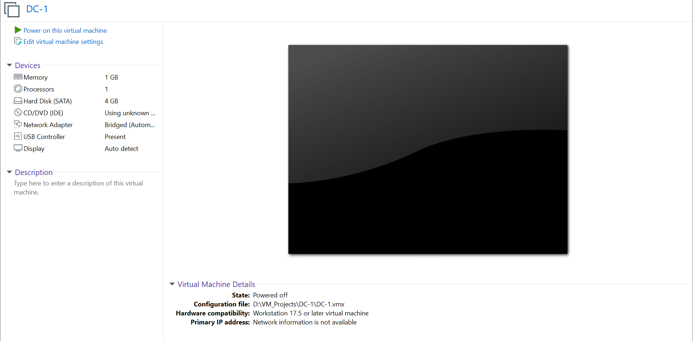

---

## Attacker Positioning and Validation

The Kali Linux attacker machine retained its NAT adapter for internet access while a second interface was connected to VMnet2, positioning Kali as an external attacker with access to the DMZ segment.

An ARP scan was performed from Kali to confirm active systems on the DMZ segment and verify DC:1 was reachable at 10.10.10.130.

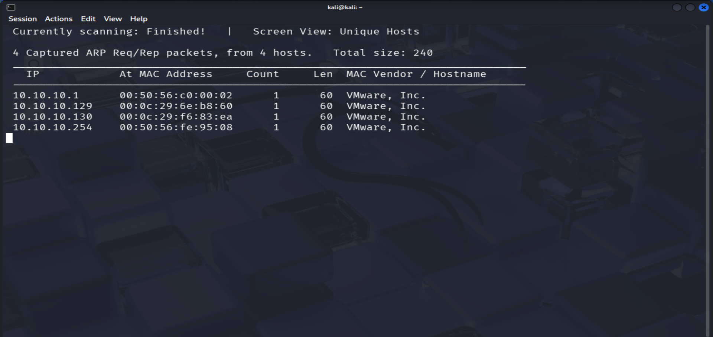

> Note: The Kali network interfaces screenshot is excluded from this repository for privacy reasons.

---

## pfSense Web Interface Access

By default, pfSense blocks management access from the WAN interface. Packet filtering was temporarily disabled using `pfctl -d` from the console shell to gain initial WebGUI access from the DMZ segment. This is a lab-only step and is not appropriate outside of an isolated environment.

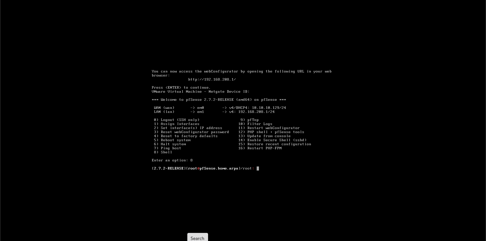

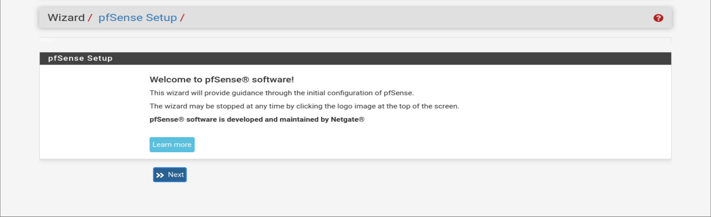

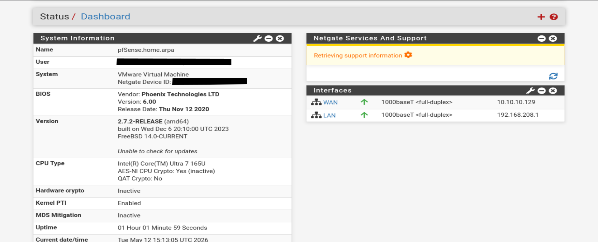

---

## Firewall Rules and Segmentation

The default WAN ruleset blocks all inbound traffic from untrusted external networks unless explicit pass rules are created.

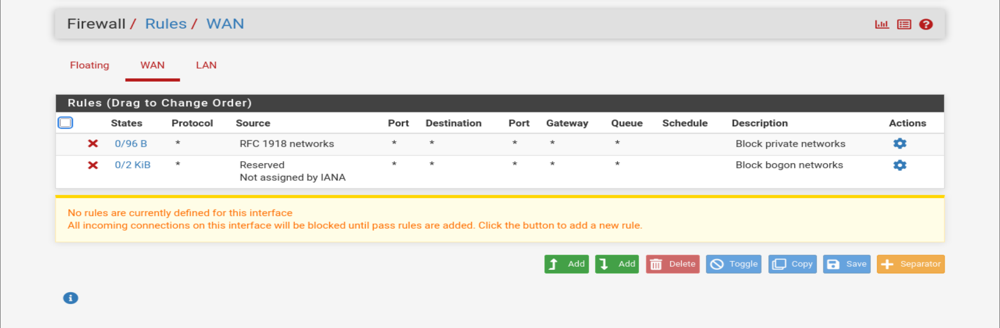

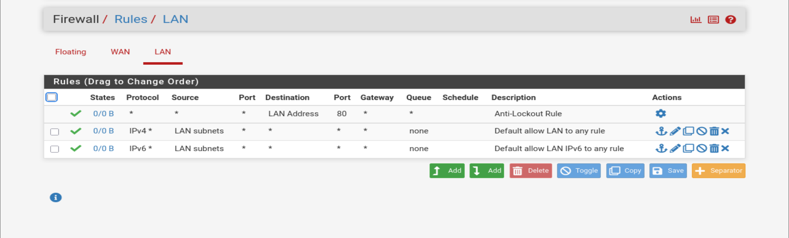

A selective allow rule was added to the WAN interface to simulate a common real-world misconfiguration:

| Interface | Action | Source | Destination | Protocol | Description |
|---|---|---|---|---|---|
| WAN | Pass | 10.10.10.130 | 192.168.208.0/24 | TCP | Selective allow — DC:1 to internal (lab misconfiguration) |

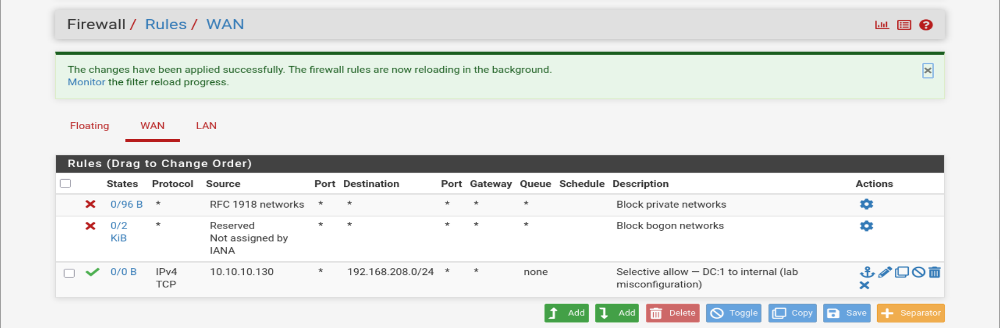

This rule creates a potential pivot path from DC:1 into the internal Active Directory environment. Exploitation and validation of this path will be performed in future projects.

---

## Configuration Notes

- pfSense packet filtering was temporarily disabled using `pfctl -d` to gain initial WebGUI access. Packet filtering was re-enabled once the management interface rule was configured correctly.
- The DC:1 VulnHub appliance triggered an OVF compliance warning on import. The import was retried with relaxed compliance checks and completed successfully.
- The Kali network interfaces screenshot is excluded from this repository for privacy reasons.

---

## Lab Readiness

The segmented environment is fully operational:

- pfSense is deployed and enforcing network segmentation between the DMZ and internal AD network
- DC:1 is deployed on the DMZ segment and reachable from Kali at 10.10.10.130
- The MARVEL.local internal network remains isolated behind the pfSense LAN interface
- The intentional firewall misconfiguration is in place as the starting point for future exploitation exercises

This project establishes the network architecture required for future pivoting and lateral movement exercises.

