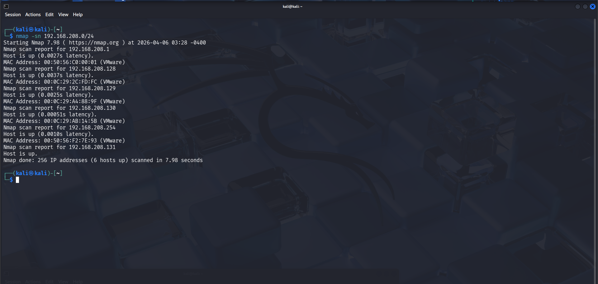
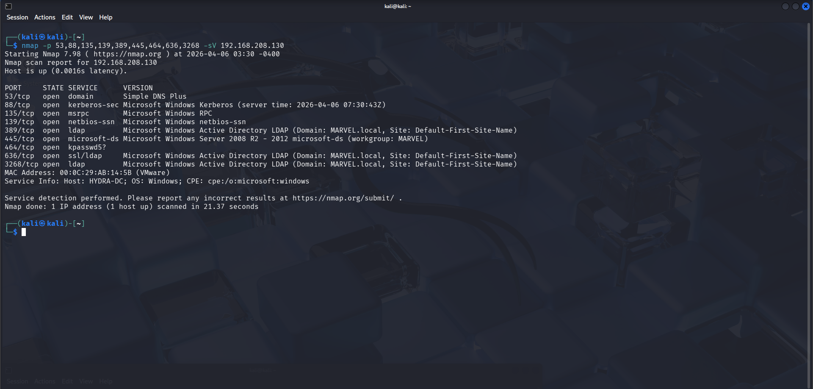
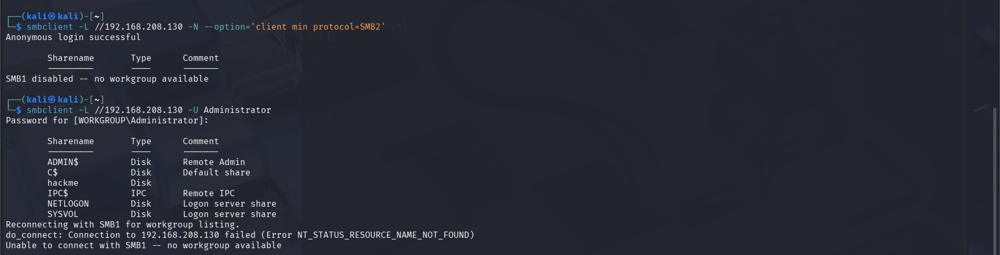
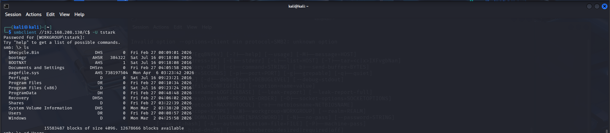
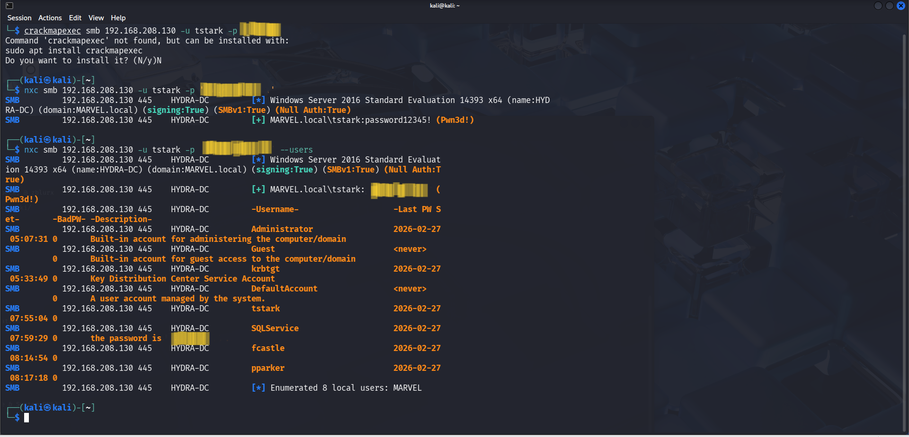
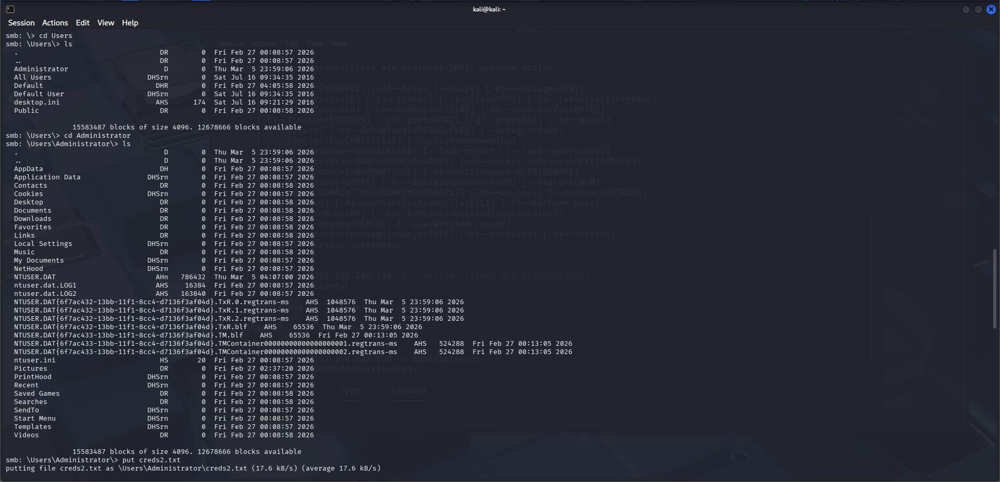
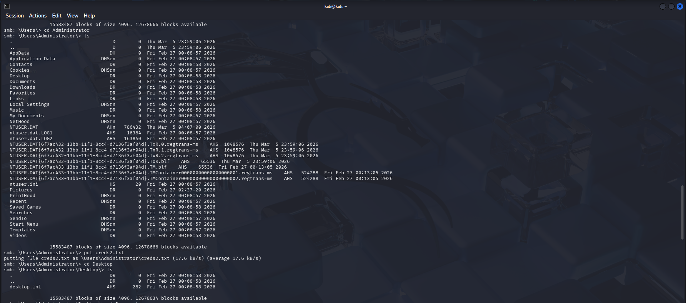

# Project 3 – Enumeration & Initial Compromise

## Overview

This project demonstrates the process of identifying active hosts, enumerating services, and validating credentials to achieve initial access within an Active Directory environment.

The objective is to simulate a real-world attack scenario by discovering exposed services, leveraging SMB authentication, and confirming access to sensitive system directories.

---

## Lab Environment

- Attacker Machine: Kali Linux  
- Target System: HYDRA-DC (192.168.208.130)  
- Domain: MARVEL.local  

---

## Reconnaissance – Host Discovery

A network sweep was performed to identify active hosts within the subnet.

```bash
nmap -sn 192.168.208.0/24
```



*Figure: Identifying live hosts on the network*

---

## Service Enumeration

A targeted scan was conducted to identify open ports and running services on the target system.

```bash
nmap -p 53,88,135,139,389,445,464,636,3268 -sV 192.168.208.130
```



*Figure: Enumeration of Active Directory-related services*

---

## SMB Enumeration

SMB shares were enumerated to identify accessible resources on the target system.

```bash
smbclient -L //192.168.208.130 -U Administrator
```



*Figure: Listing available SMB shares*

---

## Credential Validation

Valid credentials were identified and used to authenticate against the SMB service.

```bash
nxc smb 192.168.208.130 -u tstark -p 'password1234'
```



*Figure: Successful authentication using valid credentials*

---

## User Enumeration

Authenticated access allowed enumeration of domain users.

```bash
nxc smb 192.168.208.130 -u tstark -p 'password1234' --users
```



*Figure: Enumerating domain users*

---

## Administrative Access

Using validated credentials, access to sensitive directories was achieved.

```bash
smbclient //192.168.208.130/C$ -U tstark
```



*Figure: Accessing Administrator directory*

---

## File Upload – Proof of Access

A file was successfully uploaded to confirm write access to the system.

```bash
put creds2.txt
```



*Figure: Uploading file to target system*

---

## Analysis

- Active hosts were successfully identified within the network
- Critical services such as SMB, LDAP, and Kerberos were exposed
- SMB enumeration revealed accessible shares
- Valid credentials were discovered and verified
- Authenticated enumeration exposed domain users
- Administrative directories were accessed
- File upload confirmed successful initial compromise

---

## Key Takeaways

- SMB services expose a significant attack surface in Active Directory environments  
- Weak or reused credentials can lead to immediate compromise  
- Enumeration is critical to understanding the attack surface  
- Credential validation is a key step in progressing an attack  
- Early access can quickly escalate to full system compromise  

---

## Conclusion

This project demonstrates how attackers move from reconnaissance to initial compromise through structured enumeration and credential validation. The ability to authenticate and interact with the target system highlights the importance of strong access controls and monitoring in enterprise environments.

