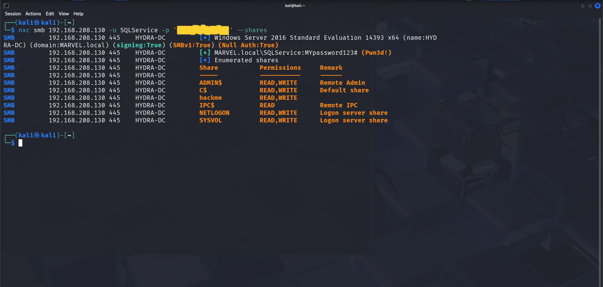
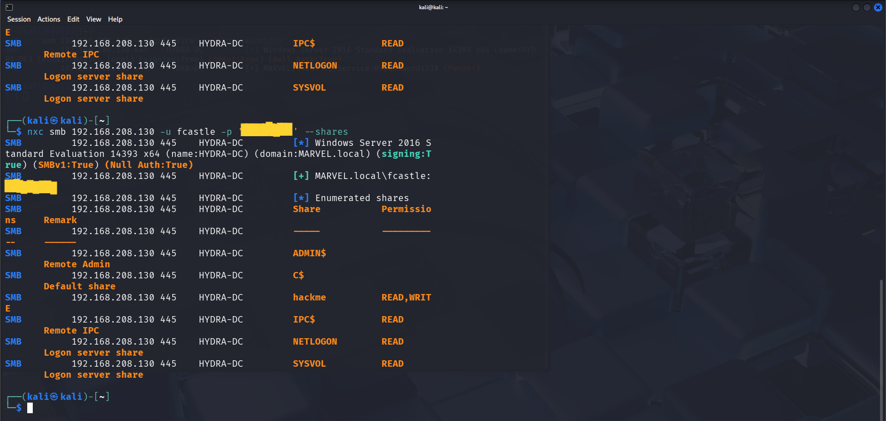
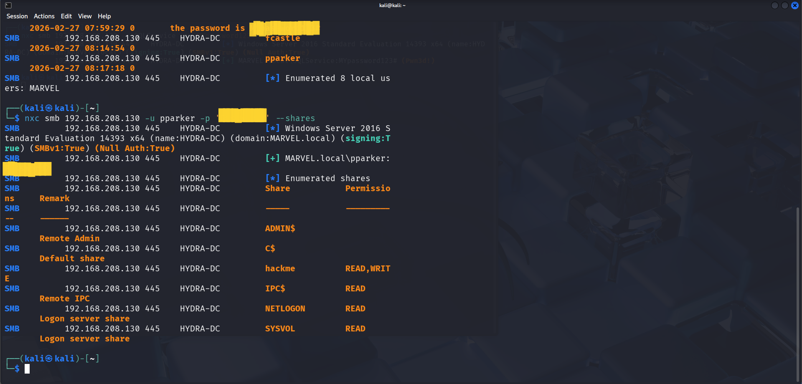
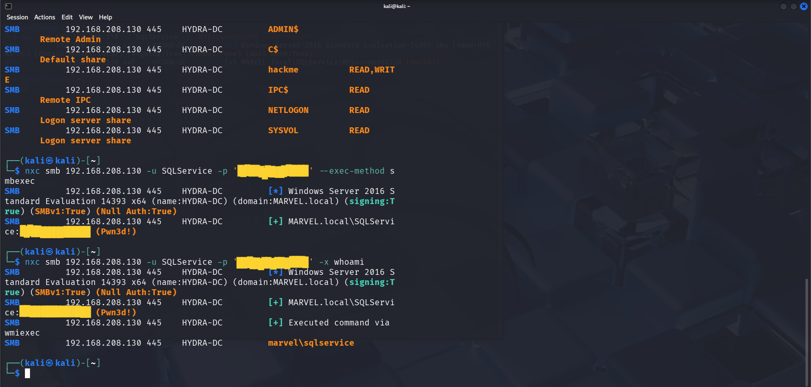

# Project 4 – Post-Exploitation & Remote Command Execution

## Overview

This project demonstrates post-exploitation techniques following initial compromise, focusing on credential validation, privilege assessment, and remote command execution.

The objective is to determine the level of access gained, identify privilege differences across accounts, and confirm the ability to execute commands remotely on the target system.

---

## Lab Environment

- Attacker Machine: Kali Linux  
- Target System: HYDRA-DC (192.168.208.130)  
- Domain: MARVEL.local  

---

## Privilege Validation – Service Account

The compromised SQLService account was used to enumerate SMB shares and assess privilege levels.

```bash
nxc smb 192.168.208.130 -u SQLService -p 'password1234' --shares
```



*Figure: SQLService account showing read/write access to administrative shares*

---

## Analysis

- SQLService account has READ and WRITE access to ADMIN$ and C$  
- Indicates administrative-level privileges  
- Confirms over-privileged service account  

---

## User Enumeration & Credential Exposure

Domain users were enumerated using the compromised service account.

```bash
nxc smb 192.168.208.130 -u SQLService -p 'password1234' --users
```



*Figure: Enumeration of domain users using compromised credentials*

---

## Analysis

- Multiple domain users identified  
- Sensitive credentials exposed in user attributes  
- Indicates poor Active Directory hygiene  
- High risk of credential reuse across systems  

---

## Privilege Comparison – Standard Users

Additional accounts were tested to compare access levels.

```bash
nxc smb 192.168.208.130 -u fcastle -p 'password1234' --shares
nxc smb 192.168.208.130 -u pparker -p 'password1234' --shares
```



*Figure: Standard users showing limited access compared to SQLService*

---

## Analysis

- Standard users authenticated successfully  
- No access to administrative shares  
- Limited permissions on SYSVOL and NETLOGON  
- Confirms privilege separation exists  

---

## Remote Command Execution

Remote command execution was tested using the SQLService account.

```bash
nxc smb 192.168.208.130 -u SQLService -p 'password1234' -x whoami
```



*Figure: Successful remote command execution on target system*

---

## Analysis

- Command execution successful  
- Executed remotely via SMB  
- Returned: `marvel\sqlservice`  
- Confirms full control of target system  

---

## Key Findings

- Sensitive credentials exposed in Active Directory  
- SQLService account over-privileged with administrative access  
- Credential reuse present across multiple accounts  
- Standard users have restricted access  
- Remote command execution successfully achieved  

---

## Conclusion

This project demonstrates how compromised credentials can be leveraged to escalate access and execute commands remotely within an Active Directory environment.

An over-privileged service account combined with weak credential management enabled full system compromise.

This highlights how misconfigurations in access control and credential storage can lead to complete domain compromise.

---

## Mitigation

- Remove sensitive data from Active Directory attributes  
- Enforce least privilege on service accounts  
- Implement strong and unique password policies  
- Monitor SMB activity and authentication attempts  
- Replace service accounts with managed service accounts  
