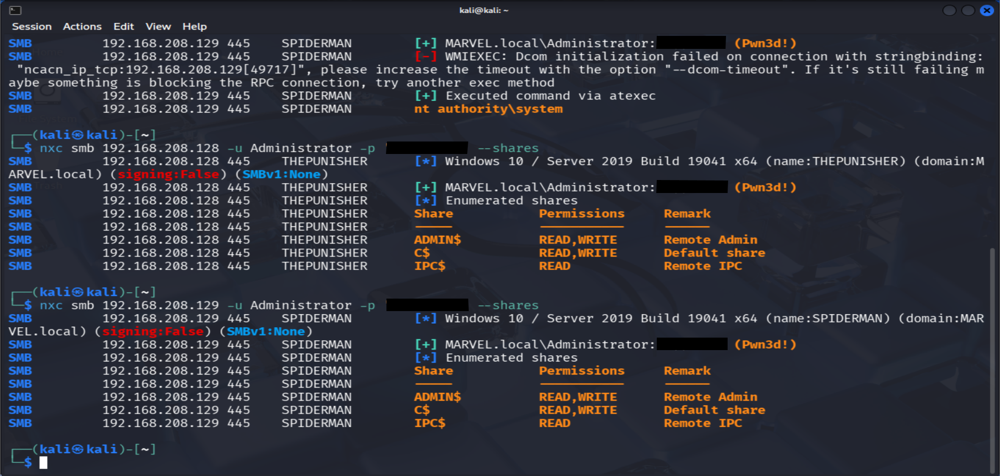
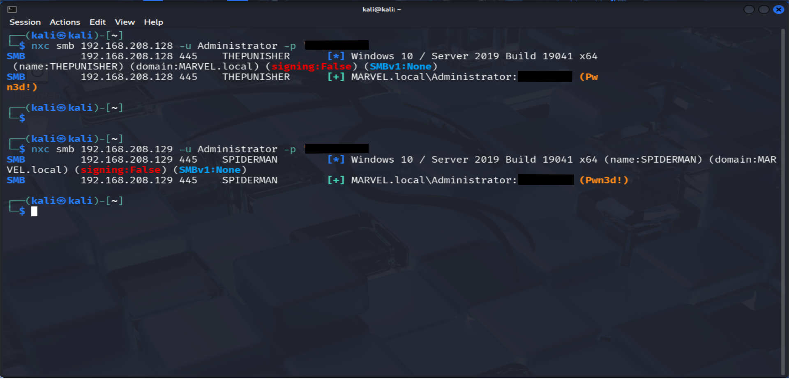
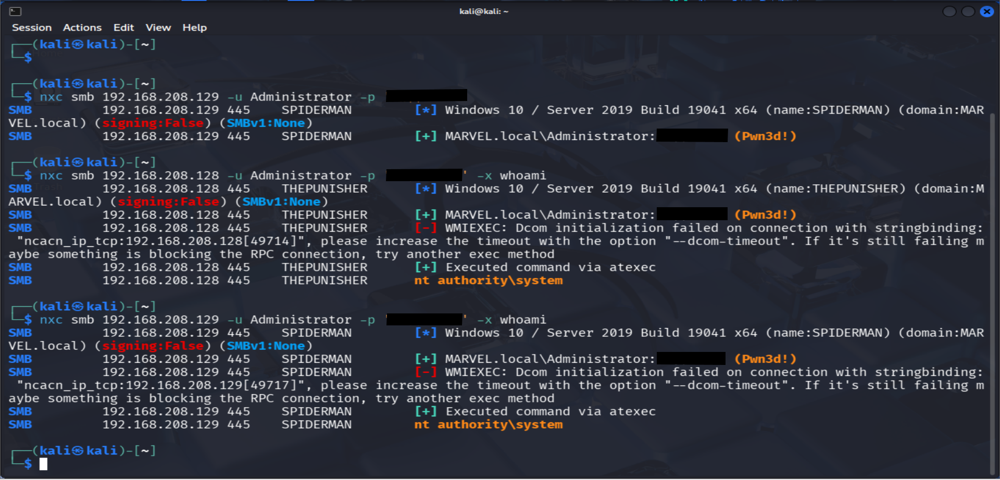

# Project 6 - Lateral Movement & Domain Expansion

## Overview

This project demonstrates how compromised administrative credentials can be reused to move laterally across a domain and gain control over additional systems.

The objective is to validate credential reuse, execute remote commands on multiple hosts, and confirm full administrative access across the network.

---

## Lab Environment

- Attacker Machine: Kali Linux  
- Target Systems:  
  - THEPUNISHER (192.168.208.128)  
  - SPIDERMAN (192.168.208.129)  
- Domain: MARVEL.local  

---

## Authentication Across Systems

Authentication attempts were performed using the compromised Administrator credentials.

```bash
nxc smb 192.168.208.128 -u Administrator -p 'password1234'
nxc smb 192.168.208.129 -u Administrator -p 'password1234'
```



**Key findings:**
- Successful authentication on both systems  
- `(Pwn3d!)` confirms valid administrative credentials  
- Credential reuse across domain machines  

---

## Remote Command Execution

To validate the level of access, remote command execution was performed.

```bash
nxc smb 192.168.208.128 -u Administrator -p 'password1234' -x whoami
nxc smb 192.168.208.129 -u Administrator -p 'password1234' -x whoami
```



**Result:**
- Commands executed successfully on both systems  
- Output returned: `nt authority\system`  
- Confirms SYSTEM-level privileges  

---

## SMB Share Enumeration

Further validation was conducted by enumerating SMB shares.

```bash
nxc smb 192.168.208.128 -u Administrator -p 'password1234' --shares
nxc smb 192.168.208.129 -u Administrator -p 'password1234' --shares
```



**Key findings:**
- ADMIN$ → READ, WRITE  
- C$ → READ, WRITE  
- IPC$ → READ  

- Full administrative access to both systems confirmed  

---

## Findings

- Credential reuse across multiple domain systems  
- No effective network segmentation  
- Full administrative access across hosts  
- Remote command execution without restriction  
- Over-reliance on shared Administrator credentials  

---

## Conclusion

This project demonstrates a successful lateral movement attack using compromised administrative credentials.

**Key takeaways:**
- Credential reuse enables rapid domain-wide compromise  
- Administrative accounts provide immediate lateral movement capability  
- Lack of segmentation allows unrestricted access between systems  
- SYSTEM-level execution confirms total control over target machines  

This highlights the importance of credential hygiene, privileged access management, and network segmentation in Active Directory environments.
