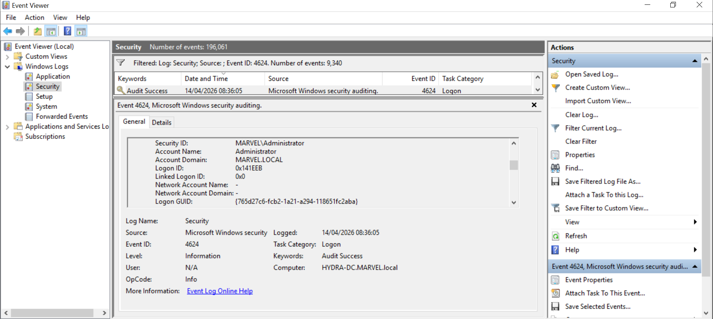
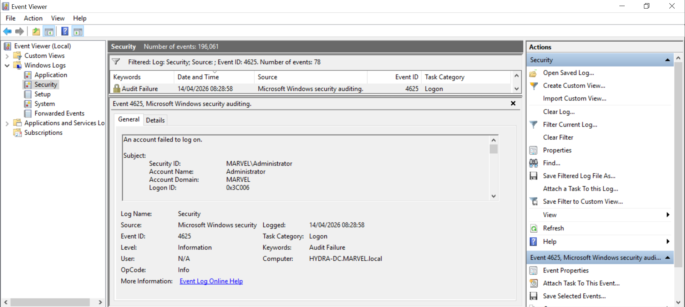
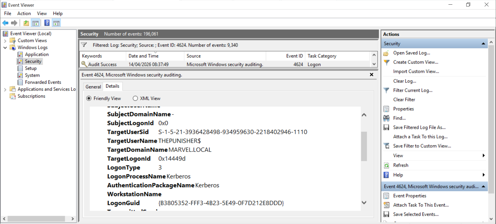

# Project 7 – Lateral Movement SMB (Credential Reuse)

---

## Overview

This project demonstrates how compromised credentials can be reused to access another system within the network.

The objective is to simulate lateral movement by authenticating to a remote system over SMB using valid credentials and observing both successful and failed authentication attempts.

---

## Lab Environment

- Attacker Machine: Kali Linux  
- Target System: HYDRA-DC (192.168.208.130)  

---

## Lateral Movement Attempt

Using valid credentials, access to the remote system was attempted.

```bash
smbclient //192.168.208.130/C$ -U Administrator
```

---

## Successful Authentication Evidence



*Figure: Successful SMB authentication using valid credentials*

---

## Analysis

- Valid credentials successfully reused  
- Access to remote system achieved  
- Confirms lateral movement via SMB  

---

## Failed Authentication Attempt

An additional attempt was made using incorrect credentials.

---

## Failed Authentication Evidence



*Figure: Failed authentication attempt using invalid credentials*

---

## Analysis

- Invalid credentials rejected  
- Authentication controls in place  
- Failed attempts still generate logs  

---

## Authentication Details

Further inspection of authentication activity:

---

## Detailed View Evidence



*Figure: Authentication events showing login behavior and system response*

---

## Analysis

- Authentication activity recorded by system  
- Both success and failure events observable  
- Provides visibility into lateral movement attempts  

---

## Key Findings

- Valid credentials can be reused across systems  
- SMB enables lateral movement within the network  
- Both successful and failed authentication attempts are logged  
- Authentication logs provide visibility into attacker behavior  

---

## Conclusion

This project demonstrates how attackers can move laterally within a network using valid credentials.

Even simple credential reuse can provide access to additional systems, increasing the overall impact of an attack.

---

## Mitigation

- Limit use of privileged accounts  
- Enforce strong password policies  
- Implement multi-factor authentication (MFA)  
- Monitor authentication logs for unusual activity  
- Restrict SMB access between systems  
