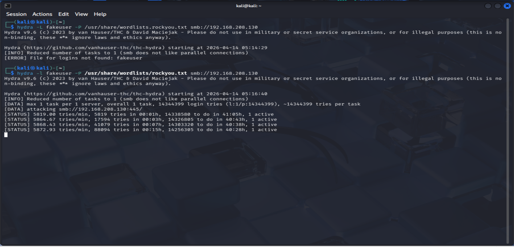

# Project 8 – SMB Brute Force

---

## Overview

This project demonstrates how SMB brute-force attacks can be executed against a target system to validate credentials and identify weak authentication controls.

---

## Lab Environment

- Attacker Machine: Kali Linux  
- Target System: HYDRA-DC (192.168.208.130)  

---

## Reconnaissance

Initial connectivity verified:

```bash
ping 192.168.208.130
```

SMB exposure confirmed:

```bash
nmap -p 445 192.168.208.130
```

---

## Reconnaissance Evidence


*Figure: Target reachable and SMB port 445 open*

---

## Analysis

- Target reachable  
- SMB port exposed  
- Authentication surface identified  

---

## Attack Execution

Hydra used to perform SMB brute-force attack:

```bash
hydra -l Administrator -P /usr/share/wordlists/rockyou.txt smb://192.168.208.130 -m "local"
```

---

## Attack Execution Evidence



*Figure: Hydra performing brute-force authentication attempts*

---

## Analysis

- High volume of login attempts generated  
- Administrator account targeted  
- Brute-force behavior confirmed  

---

## Credential Validation Evidence


*Figure: Authentication attempts generating validation events*

---

## Analysis

- Authentication attempts logged by system  
- Credential validation activity observed  
- Confirms attack interaction with SMB authentication  

---

## Key Findings

- SMB exposed as an authentication attack surface  
- Brute-force attack successfully executed  
- Authentication activity clearly generated  
- Weak security controls enable repeated attempts  

---

## Conclusion

This project demonstrates how attackers can leverage SMB to perform brute-force attacks and generate authentication activity.

Even without confirmed credential success, the attack produces observable behavior that can be used for detection.

---

## Mitigation

- Implement account lockout policies  
- Enforce strong password requirements  
- Monitor authentication activity  
- Restrict SMB access where possible  

