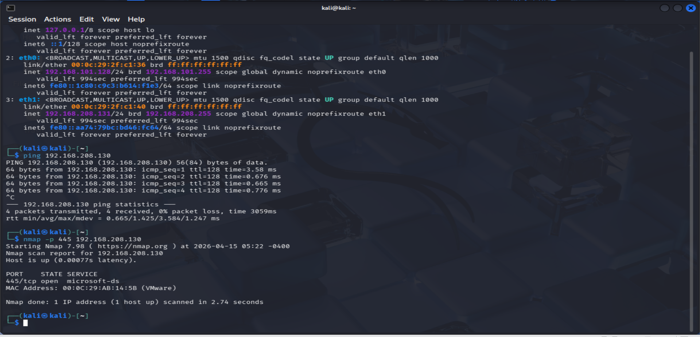
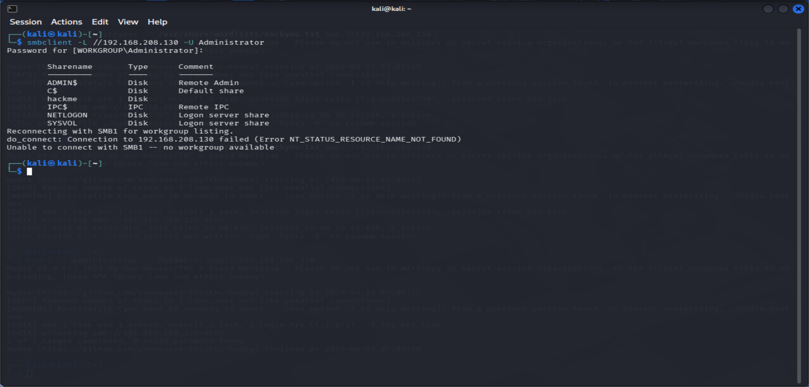
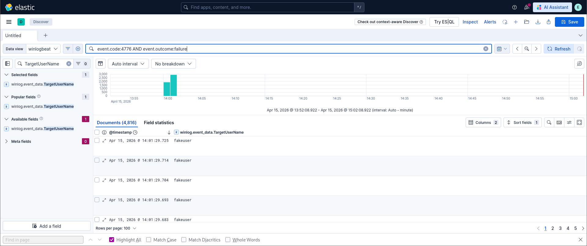
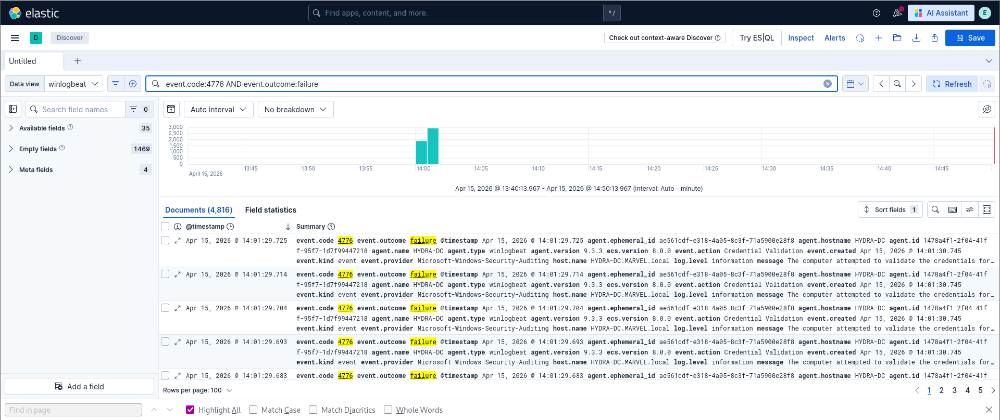

# Project 9 – SMB Brute Force & Log Validation

---

## Overview

This project demonstrates how SMB brute-force attacks can be executed, validated, and detected using Windows Security logs and Elastic SIEM.

The objective is to simulate credential-based attacks, observe authentication behavior, and identify indicators of attack activity through log analysis.

---

## Lab Environment

- Attacker Machine: Kali Linux  
- Target System: HYDRA-DC (192.168.208.130)  
- Logging & Detection: Elastic (Winlogbeat)  

---

## Reconnaissance

Initial connectivity to the target system was verified.

```bash
ping 192.168.208.130
```

SMB exposure confirmed via port scanning:

```bash
nmap -p 445 192.168.208.130
```

---

## Reconnaissance Evidence



*Figure: Target host reachable and SMB port 445 open*

---

## Analysis

- Target host reachable  
- Port 445 open  
- SMB exposed as an authentication surface  

---

## SMB Enumeration

SMB shares were enumerated:

```bash
smbclient -L //192.168.208.130 -U Administrator
```

---

## SMB Enumeration Evidence



*Figure: SMB shares accessible confirming authentication exposure*

---

## Analysis

- SMB shares accessible  
- Authentication interface exposed  
- Valid attack surface identified  

---

## Attack Execution

Hydra used to simulate SMB authentication attacks:

```bash
hydra -l Administrator -p 'Password123' smb://192.168.208.130 -m "local"
```

---

## Attack Execution Evidence


*Figure: Hydra performing SMB authentication attempts against the target system*

---

## Analysis

- Repeated SMB authentication attempts executed  
- Administrator account targeted  
- Authentication traffic successfully generated  

---

## Invalid User Testing

Fake usernames used to simulate enumeration behavior.

---

## Username Enumeration Evidence



*Figure: Authentication attempts using invalid usernames*

---

## Analysis

- Repeated attempts using fake usernames  
- Indicates username enumeration activity  
- Failed authentication events generated  

---

## Failed Authentication Evidence



*Figure: High-frequency Event ID 4776 failures observed*

---

## Analysis

- Event ID 4776 failures observed  
- High-frequency authentication attempts detected  
- Clear brute-force pattern visible  

---

## Detection Methodology

Windows Security logs analyzed using Elastic (Winlogbeat).

### Key Event ID

- 4776 – Credential Validation  

---

## Detection Evidence


*Figure: SIEM visualization showing authentication spikes*

---

## Analysis

- Event ID 4776 activity observed  
- Authentication spikes align with attack execution  
- Repeated authentication attempts from source system  

---

## Key Findings

- SMB exposed as an authentication attack surface  
- Brute-force behavior clearly visible in logs  
- Combination of:
  - Username enumeration  
  - Credential validation attempts  
- Hydra attack activity directly correlates with authentication spikes in SIEM  
- Event ID 4776 critical for detecting SMB authentication attacks  

---

## Conclusion

This project demonstrates how SMB brute-force attacks can be executed and detected through log analysis.

Even without successful logins, authentication attempts generate clear indicators of malicious activity.

Detection relies on behavioral patterns such as:
- High-frequency authentication attempts  
- Repeated failures  
- Username enumeration  

---

## Mitigation

- Implement account lockout policies  
- Enforce strong password requirements  
- Monitor Event ID 4776  
- Restrict SMB access where possible  
- Implement alerting for authentication spikes  

