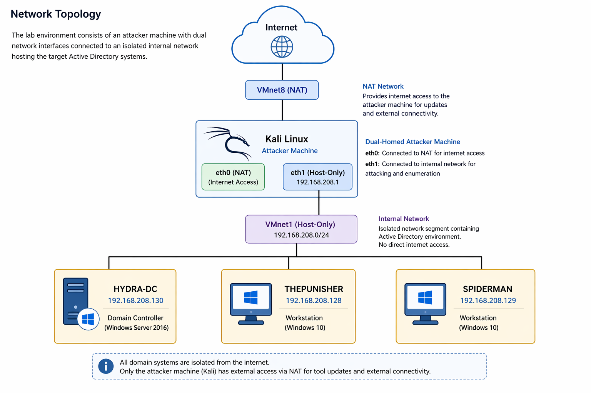

# Active Directory Attack & Detection Lab

This repository documents a full internal Active Directory compromise, simulating real-world attacker behavior from initial access to domain-wide control.

The lab demonstrates how weak credential management, over-privileged service accounts, and lack of network segmentation can lead to complete domain compromise.

It also includes detection and validation using Windows Security logs and the Elastic Stack, highlighting how attacker activity can be identified through log correlation.

---

## Key Highlights

- End-to-end attack lifecycle (Recon → Compromise → Domain Admin)
- Credential dumping (Mimikatz & secretsdump)
- Pass-the-Hash lateral movement
- SYSTEM-level remote execution (PsExec)
- Detection using Elastic SIEM (Event IDs 4624, 4672, etc.)
- Correlation of attacker behavior through log analysis
- Attack path analysis and misconfiguration mapping using BloodHound
- Real-world home network penetration test with full remediation

---

## Key Outcome

A low-privileged foothold was escalated to full Domain Administrator access through credential discovery, privilege escalation, and lateral movement across multiple systems.

BloodHound analysis confirmed the attack paths and identified additional critical vulnerabilities including ADCS escalation paths and DCSync rights misconfigurations.

A standalone home network penetration test was also conducted, identifying multiple vulnerabilities across two routers and applying full remediation including firmware updates, service hardening, and credential hygiene.

---

## Network Topology

All domain systems are isolated from the internet. Only the attacker machine (Kali Linux) has external access via NAT for tool updates and external connectivity.

---

## Attack Scenario

An attacker gains access to the internal network and begins reconnaissance of the domain environment.

Through enumeration, valid credentials are discovered and used to authenticate against SMB services.

A misconfigured service account with excessive privileges is identified, allowing:

- Administrative access to critical systems
- Remote command execution
- Credential dumping (SAM & LSA)

Using these credentials, the attacker escalates privileges to Domain Administrator and moves laterally across multiple systems, achieving full domain compromise.

BloodHound analysis then maps the exact attack paths and relationships that made the compromise possible, identifying additional misconfigurations including ADCS vulnerabilities and DCSync rights assigned to over-privileged groups.

Detection analysis shows that this activity can be identified through:

- Authentication event patterns
- Credential validation spikes
- SIEM correlation of Windows Security logs

---

## Attack Path Overview

This lab demonstrates a complete attack chain:

1. Enumeration & Initial Access
2. Credential Discovery
3. Privilege Escalation
4. Lateral Movement
5. Domain Compromise
6. Detection & Log Analysis
7. Attack Path Analysis (BloodHound)
8. Home Network Penetration Test & Remediation

---

## Project Breakdown

Each phase of the attack lifecycle is documented below:

1. [Project 1 – Lab Setup](./Project-1-Lab-Setup)
2. [Project 2 – Network Reconnaissance](./Project-2-Network-Reconnaissance)
3. [Project 3 – Enumeration & Initial Compromise](./Project-3-Enumeration-&-Initial-Compromise)
4. [Project 4 – Post-Exploitation](./Project-4-Post-Exploitation)
5. [Project 5 – Domain Enumeration & Privilege Escalation](./Project-5-Domain-Enumeration-&-Privilege-Escalation)
6. [Project 6 – Lateral Movement & Domain Expansion](./Project-6-Lateral-Movement-&-Domain-Expansion)
7. [Project 7 – Lateral Movement Detection](./Project-7-Lateral-Movement)
8. [Project 8 – SMB Brute Force](./Project-8-Brute-Force-SMB)
9. [Project 9 – Log Validation & Detection](./Project-9-Log-Validation-SMB)
10. [Project 10 – Credential Access, Pass-the-Hash, and Detection Validation](./Project-10-Credential-Access-Pass-the-Hash-Detection)
11. [Project 11 – Active Directory Attack Path Analysis (BloodHound)](./Project-11-Active-Directory-Attack-Path-Analysis-BloodHound)
12. [Project 12 – Home Network Penetration Test](./Project-12-Home-Network-Penetration-Test)

---

## Skills Demonstrated

- Active Directory Enumeration
- SMB Exploitation & Credential Attacks
- Privilege Escalation Techniques
- Lateral Movement Across Domain Environments
- Remote Command Execution
- SIEM Log Analysis (Elastic Stack)
- Detection of Brute Force & Authentication Attacks
- Correlation of Attack Activity with Security Logs
- Active Directory Attack Path Analysis (BloodHound)
- ADCS Vulnerability Identification
- DCSync Rights Enumeration
- Network Scanning & Service Enumeration
- CVE Research & Vulnerability Analysis
- Router Hardening & Firmware Management
- Remediation Verification

---

## Key Security Risks Identified

- Over-privileged service accounts enabled full system compromise
- Weak password policies allowed successful credential cracking
- Credential reuse enabled lateral movement across domain systems
- Lack of network segmentation allowed unrestricted access between hosts
- Absence of account lockout policies enabled brute-force attacks
- ADCS misconfiguration enabled certificate-based privilege escalation
- DCSync rights assigned to over-privileged groups enabled domain-wide hash extraction
- UPnP enabled on home router running outdated MiniUPnP 1.8 with known CVEs
- Outdated SSH service (Dropbear 2019.78) exposed on non-standard port

---

## Detection Insights

- Event ID 4776 (Credential Validation) reveals authentication attack patterns
- High-frequency authentication attempts indicate brute-force activity
- Correlation between failed and successful logons highlights credential testing
- Logon Type 3 (Network Logon) indicates lateral movement
- SIEM aggregation enables visibility into attacker behavior
- Event ID 4662 identifies DCSync activity from non-Domain Controller accounts
- Event IDs 4886 and 4887 identify suspicious certificate requests via ADCS

---

## Impact

Successful exploitation of the identified weaknesses resulted in:

- Full Domain Administrator access
- Remote command execution across multiple systems
- Exposure of sensitive credentials and authentication data
- Ability to control and manipulate domain resources

This level of access would allow an attacker to:

- Deploy ransomware across the network
- Exfiltrate sensitive data
- Maintain persistent access within the environment

---

## Mitigation & Recommendations

- Implement account lockout policies
- Enforce strong password complexity and rotation
- Apply the principle of least privilege to all accounts
- Replace standard service accounts with managed service accounts
- Restrict SMB access to trusted systems
- Monitor authentication events (Event ID 4624, 4625, 4776)
- Implement SIEM alerting for abnormal authentication patterns
- Correlate authentication events with logon activity
- Audit and remediate ADCS certificate template permissions
- Remove DCSync rights from all groups except Domain Controllers
- Enable Credential Guard to protect credentials in memory
- Disable UPnP on home and enterprise routers unless explicitly required
- Keep router firmware updated and enable automatic updates

---

## Lab Environment

- Domain: MARVEL.local
- Attacker Machine: Kali Linux
- Target Systems: Domain Controller + Workstations
- Logging & Detection: Elastic Stack (Winlogbeat)

---

## Summary

This project demonstrates both offensive and defensive capabilities within an Active Directory environment.

From an offensive perspective, it simulates a complete attack lifecycle including enumeration, credential compromise, privilege escalation, and lateral movement leading to full domain control.

From a defensive perspective, it validates how attacker activity can be detected using Windows Security logs and SIEM correlation. Key detection points include credential validation events (Event ID 4776), failed and successful logons (Event IDs 4625 and 4624), and network-based authentication patterns (Logon Type 3).

BloodHound analysis adds a third dimension — mapping the exact misconfigurations and attack paths that made the compromise possible, and identifying additional vulnerabilities such as ADCS escalation paths and DCSync rights misconfigurations that would allow further exploitation.

Project 12 extends the scope beyond the lab environment into a real-world home network assessment, demonstrating the ability to apply penetration testing methodology against live infrastructure and carry out full remediation.

By combining attack execution, detection analysis, attack path mapping, and real-world network assessment, this lab demonstrates a complete understanding of both attacker tradecraft and the practical skills required to identify, remediate, and document security vulnerabilities.
