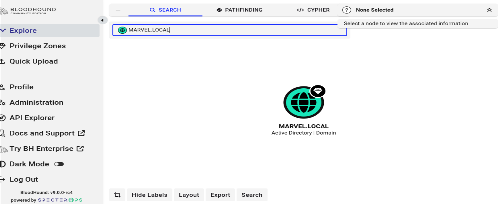
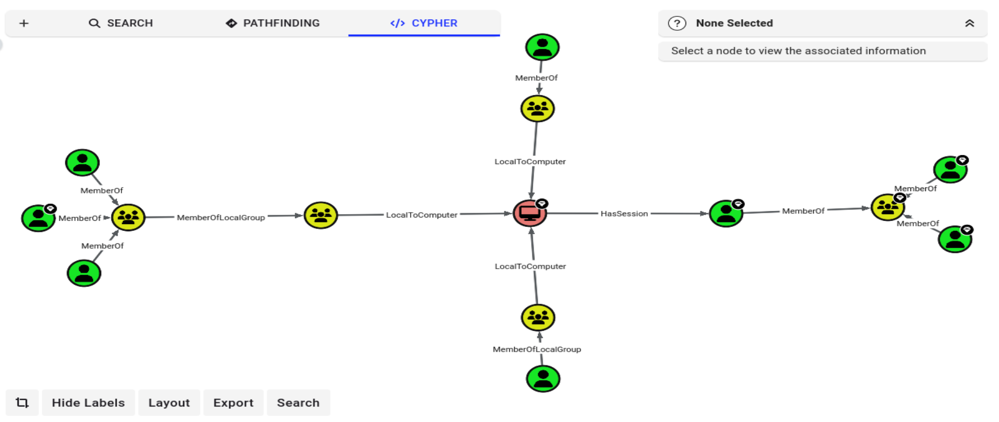
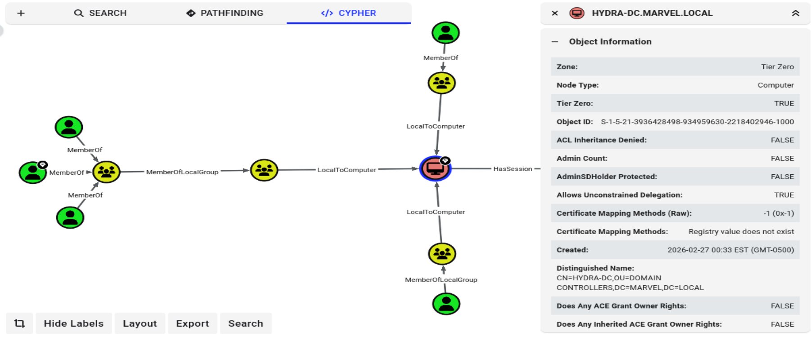
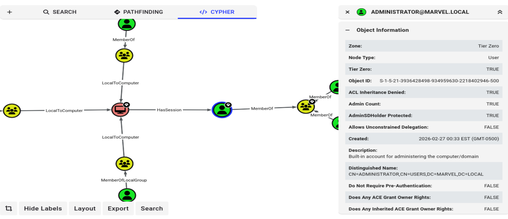
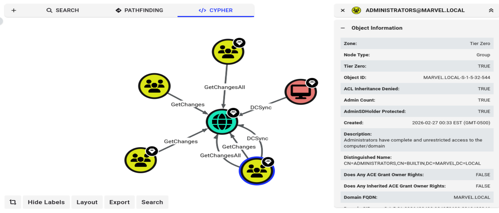

# AD Attack Path Analysis (BloodHound)

This project demonstrates how BloodHound Community Edition can be used to map an Active Directory environment, identify hidden attack paths, and explain why privilege escalation to Domain Admin was possible.

---

## Objective

Collect Active Directory data using SharpHound, analyse attack paths in BloodHound, and identify the misconfigurations that enabled the attacks demonstrated across this project series.

---

## Lab Environment

- Kali Linux attacker machine
- HYDRA-DC (192.168.208.130) – Windows Server 2016 Domain Controller
- THEPUNISHER (192.168.208.128) – domain-joined workstation
- SPIDERMAN (192.168.208.129) – domain-joined workstation
- Domain: MARVEL.LOCAL

---

## Overview

BloodHound was used to perform a full attack path analysis of the MARVEL.LOCAL domain. Data was collected using SharpHound and imported into BloodHound Community Edition for graph-based analysis.

The analysis identified multiple critical misconfigurations that created direct paths to Domain Admin, and explained why the attacks performed in previous projects were possible.

---

## Techniques Used

- Active Directory data collection with SharpHound
- Graph-based attack path analysis with BloodHound
- Identification of ADCS escalation paths (ESC1 and ESC4)
- DCSync rights enumeration
- Session-based attack path analysis
- Unconstrained Delegation identification

---

## Evidence

### Domain Overview

MARVEL.LOCAL identified as a Tier Zero asset. Domain statistics revealed a weak password policy, 6 foreign members, and 3 ADCS escalation paths.

---

### Attack Path – User to Domain Admin

BloodHound identified the shortest path from standard domain users to Domain Admin via group memberships, local admin access, and an active Administrator session on the Domain Controller.

---

### Domain Controller – Unconstrained Delegation

HYDRA-DC confirmed as Tier Zero with Unconstrained Delegation enabled — increasing the risk of credential theft from the Domain Controller.

---

### Administrator Session Confirmed

ADMINISTRATOR@MARVEL.LOCAL confirmed as having an active session on HYDRA-DC — the credential material exploited in Projects 5 and 10.

---

### DCSync Rights – Administrators Group

ADMINISTRATORS group confirmed with full DCSync rights — explaining why secretsdump was able to retrieve all domain hashes in Project 10.

---

## Key Findings

- ADCS ESC1 and ESC4 vulnerabilities providing direct paths to Domain Admin
- Active Administrator session on the Domain Controller enabling credential theft
- ADMINISTRATORS group holds full DCSync rights enabling domain-wide hash extraction
- Unconstrained Delegation enabled on HYDRA-DC
- Weak password policy with minimum length of 7 characters
- 6 Foreign Members identified within the MARVEL.LOCAL domain

---

## Tools Used

- BloodHound Community Edition v9.0.0-rc4
- SharpHound v2.12.0
- Kali Linux

---

## Skills Demonstrated

- Active Directory attack path analysis
- BloodHound graph analysis and Cypher querying
- ADCS vulnerability identification
- DCSync rights enumeration
- Offensive and defensive security reasoning
- Correlation of attack paths with real-world exploitation

---

## Detection Opportunities

- DCSync – Event ID 4662 – replication requests from non-DC accounts
- Pass-the-Hash / Lateral Movement – Event ID 4624 – Logon Type 3 from unexpected sources
- ADCS Abuse – Event ID 4886 / 4887 – certificate requests where requester and subject differ
- Credential Dumping – Event ID 4624 / 4625 – unusual LSASS access patterns

---

## Impact

This project demonstrates how BloodHound can surface hidden attack paths that explain a complete domain compromise. The findings directly correlate with the attacks performed across Projects 3 through 10, proving that the misconfigurations identified were real and exploitable.

By combining offensive analysis with defender recommendations, this project shows both attacker tradecraft and the detection and remediation steps required to secure the environment.
