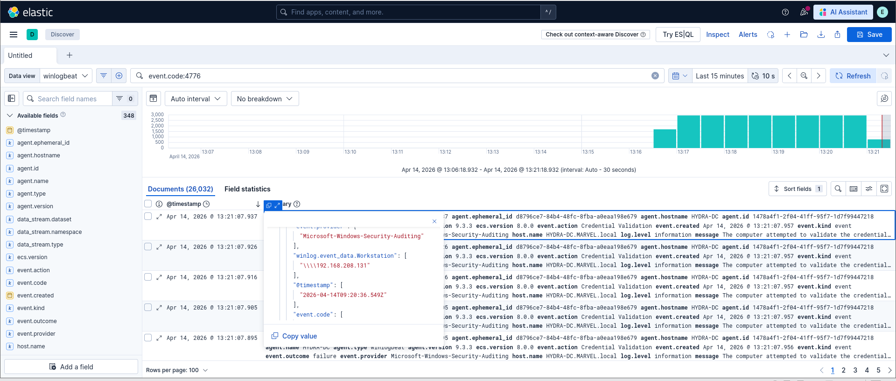

# Attack Detection with Elastic SIEM

This project demonstrates how offensive activity generated during lab attacks can be identified in an Active Directory environment using Elastic SIEM.

---

## Objective

Identify suspicious authentication activity using Windows Security logs and SIEM analysis.

---

## Lab Environment

- Kali Linux (attacker)
- Windows Server (Domain Controller)
- Elastic SIEM
- Winlogbeat

---

## Overview

After performing authentication-based attacks, logs were collected and analyzed in Elastic SIEM.

The focus was on detecting abnormal authentication behavior using Event ID 4776 and related login activity.

---

## Detection Strategy

Detection was based on identifying:

- High volumes of credential validation events  
- Failed authentication attempts  
- Login attempts using invalid usernames  

These behaviors indicate:

- Brute force attacks  
- Credential spraying  
- User enumeration  

---

## Evidence

### Credential Validation Activity (Event ID 4776)

A spike in Event ID 4776 shows repeated credential validation attempts, indicating high-volume authentication activity.

---

### Failed Authentication Attempts

Filtering for failed outcomes highlights repeated unsuccessful login attempts, a strong indicator of brute force or credential spraying attacks.

---

### Fake User / Enumeration Attempts

Login attempts using non-existent usernames (e.g., "fakeuser") reveal enumeration activity, where attackers probe for valid accounts.

---

## Key Findings

- Authentication logs clearly expose attacker behavior  
- Failed login spikes are strong indicators of attack activity  
- Enumeration often occurs before successful compromise  
- SIEM tools enable rapid detection through log correlation  

---

## Tools Used

- Elastic SIEM  
- Winlogbeat  
- Windows Security Logs  

---

## Skills Demonstrated

- SIEM log analysis  
- Detection of brute force and credential attacks  
- Windows event log investigation  
- Threat pattern recognition  

---

## Impact

This project shows how authentication attacks can be detected early using log analysis and SIEM visibility, enabling faster response to potential compromises.
