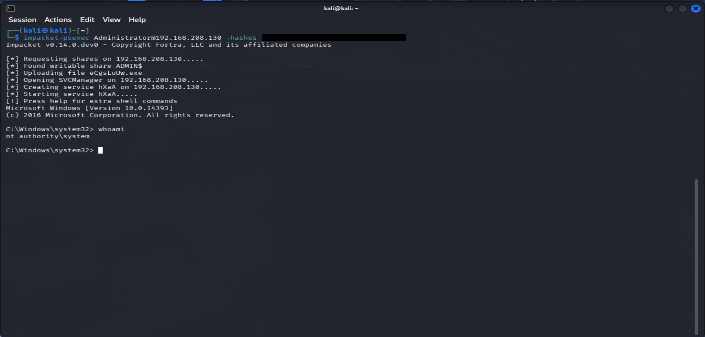

# Privilege Escalation & Domain Compromise

## Objective
Escalate privileges within a compromised environment and obtain full control of a target system using credential abuse and post-exploitation techniques.

## Lab Environment
- Kali Linux attacker machine
- Windows Server (Domain-joined)
- SMB enabled systems
- Compromised Administrator credentials

## Overview
Following successful lateral movement, compromised credentials were leveraged to execute commands remotely and escalate privileges on target systems. This demonstrates how attackers can transition from initial access to full system control without exploiting software vulnerabilities.

## Attack Workflow
- Initial access obtained via SMB brute force
- Lateral movement achieved using valid credentials
- Administrative access confirmed across systems
- Remote execution performed using authenticated sessions
- Privilege escalation achieved to SYSTEM level

## Techniques Used
- SMB authentication
- Credential reuse
- Remote command execution
- Privilege escalation via administrative access

## Evidence

### Privilege Escalation to SYSTEM

Administrative credentials were used to execute commands remotely, resulting in SYSTEM-level access on the target machine. This confirms successful privilege escalation and full control over the compromised host.

## Key Findings
- Valid credentials eliminate the need for exploits
- Administrative access can quickly lead to SYSTEM-level control
- Privilege escalation significantly accelerates attacker impact
- Credential abuse remains one of the most effective attack techniques

## Tools Used
- NetExec (nxc)
- Impacket (psexec, secretsdump)
- Kali Linux

## Skills Demonstrated
- Privilege escalation
- Credential abuse
- Remote execution
- Post-exploitation techniques
- Attack chaining across systems

## Impact
Privilege escalation to SYSTEM level demonstrates complete compromise of the target system, highlighting how attackers can gain full control of infrastructure once administrative credentials are obtained.
