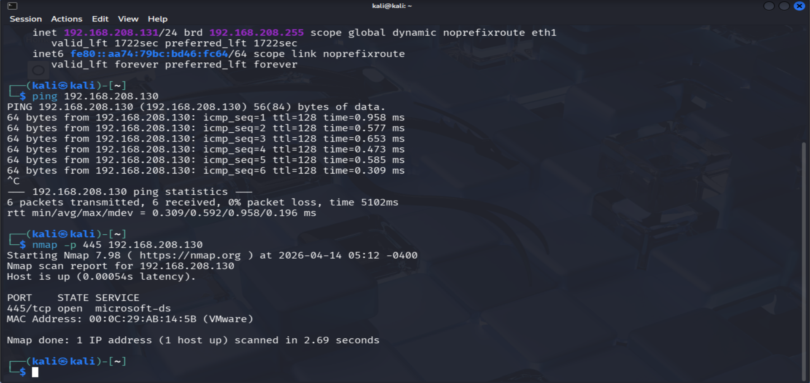
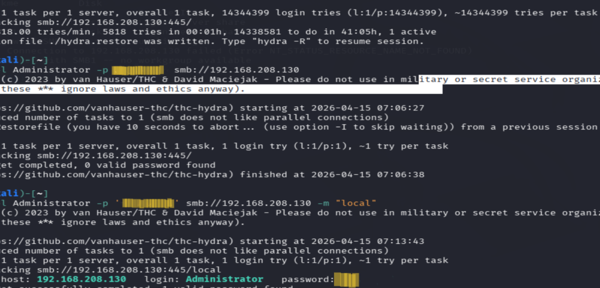

# SMB Brute Force Attack – Initial Access

This project simulates a real-world initial access scenario where weak SMB credentials are exploited to gain unauthorized access to a target system.

## Objective
Simulate an SMB brute force attack to gain initial access to a target system.

## Lab Environment
- Kali Linux attacker machine  
- Windows target host  
- SMB service exposed on the target  

## Attack Overview
This project demonstrates how exposed SMB services and weak credentials can be exploited to gain unauthorized access to a system.

The attack path included:
- Identifying SMB on the target
- Enumerating the service
- Performing a brute force attack against authentication
- Gaining access using valid credentials

## Reconnaissance
Initial network scanning identified SMB (port 445) as an exposed service on the target system.

## Enumeration
The SMB service was reviewed to identify available access points and prepare for authentication attacks.

## Exploitation
A brute force attack was executed against the SMB service using a password wordlist. The attack successfully identified valid credentials for the Administrator account, demonstrating how weak password policies can lead directly to system compromise.

## Evidence

### SMB Service Detection

### Brute Force Attack in Progress

### Successful Credential Discovery

The brute force attack successfully identified valid credentials for the Administrator account, allowing authenticated access to the target system.

### Credential Validation (Elastic SIEM)

## Key Findings
- Weak passwords can lead directly to system compromise  
- SMB services are a common and high-value attack surface  
- Credential-based attacks remain highly effective in poorly secured environments  

## Tools Used
- Nmap  
- Hydra  
- SMB client tools  
- Kali Linux  

## Skills Demonstrated
- Network reconnaissance  
- Service enumeration  
- Credential brute force attacks  
- Initial access techniques  
- Understanding of attack visibility in SIEM 

## Impact
Successful credential compromise provided authenticated access to the target system, representing a critical initial foothold that could be used for further lateral movement and privilege escalation.
