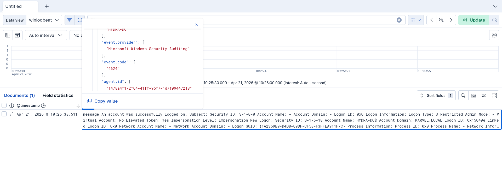

# Suspicious Logon Detection

This project demonstrates how suspicious authentication behavior can be identified using Windows Security logs and SIEM analysis.

---

## Objective

Detect abnormal login patterns by analyzing successful authentication events (Event ID 4624).

---

## Lab Environment

- Windows Server (Domain Controller)
- Elastic SIEM
- Winlogbeat

---

## Overview

Authentication logs provide critical visibility into user activity. While failed logins are commonly monitored, successful logons can reveal more subtle attacker behavior when valid credentials are used.

This project focuses on identifying suspicious patterns in successful authentication events.

---

## Detection Strategy

Detection is based on identifying:

- Unusual login frequency
- Irregular login timing
- Abnormal authentication patterns

These behaviors may indicate:

- Use of compromised credentials
- Unauthorized access
- Lateral movement within the network

---

## Evidence

### Normal Authentication Activity

Normal authentication events (Event ID 4624) show expected user login behavior under standard conditions.

---

### Suspicious Authentication Activity

Abnormal spikes or unusual patterns in successful logon events may indicate compromised credentials or unauthorized access.

---

## Analysis

Comparison of normal vs suspicious activity highlights:

- Increased login volume over short time periods
- Logins occurring outside normal behavior patterns
- Consistent authentication attempts that deviate from baseline activity

These indicators suggest:

- Credential compromise  
- Unauthorized lateral movement  
- Persistence after initial access  

---

## Key Findings

- Successful logon events (4624) can expose attacker behavior when analyzed for anomalies  
- Attackers often use valid credentials to avoid detection  
- Behavioral analysis is essential for identifying suspicious access  

---

## Tools Used

- Elastic SIEM  
- Winlogbeat  
- Windows Security Logs  

---

## Skills Demonstrated

- SIEM log analysis  
- Detection of suspicious authentication behavior  
- Windows Event Log investigation  
- Threat pattern recognition  

---

## Impact

This project demonstrates how monitoring successful authentication events enables detection of stealthy attacker activity, improving visibility and response to compromised accounts.
